# Search and Indexing Architecture

This diagram illustrates our search infrastructure using Elasticsearch and related search optimization patterns.

## Search Architecture Diagram

```mermaid
graph TB
    subgraph "Search Engine"
        subgraph "Elasticsearch"
            Index[Indices]
            Shards[Sharding]
            Replicas[Replication]
        end

        subgraph "Query Engine"
            FullText[Full Text Search]
            Fuzzy[Fuzzy Search]
            Faceted[Faceted Search]
        end

        subgraph "Ranking"
            Relevance[Relevance Score]
            Boost[Field Boost]
            Custom[Custom Scoring]
        end
    end

    subgraph "Data Processing"
        subgraph "Indexing"
            Analyzer[Text Analysis]
            Tokenizer[Tokenization]
            Filter[Filters]
        end

        subgraph "Pipeline"
            Extract[Data Extraction]
            Transform[Data Transform]
            Load[Data Loading]
        end

        subgraph "Optimization"
            Cache[Search Cache]
            Suggest[Suggestions]
            Synonyms[Synonyms]
        end
    end

    subgraph "Search Features"
        subgraph "Advanced"
            Aggregation[Aggregations]
            Highlight[Highlighting]
            Autocomplete[Autocomplete]
        end

        subgraph "Filters"
            Range[Range Filter]
            Geo[Geo Filter]
            Term[Term Filter]
        end

        subgraph "Analytics"
            Popular[Popular Terms]
            Trends[Search Trends]
            Metrics[Search Metrics]
        end
    end

    subgraph "Infrastructure"
        subgraph "Scaling"
            Cluster[ES Cluster]
            Balance[Load Balance]
            Backup[Backup/Recovery]
        end

        subgraph "Performance"
            Monitor[Monitoring]
            Tune[Performance Tune]
            Alert[Alerting]
        end

        subgraph "Security"
            Auth[Authentication]
            Access[Access Control]
            Audit[Audit Logs]
        end
    end

    %% Search Flow
    Index --> FullText
    Shards --> Fuzzy
    Replicas --> Faceted

    FullText --> Relevance
    Fuzzy --> Boost
    Faceted --> Custom

    %% Processing Flow
    Analyzer --> Extract
    Tokenizer --> Transform
    Filter --> Load

    Extract --> Cache
    Transform --> Suggest
    Load --> Synonyms

    %% Features Flow
    Aggregation --> Range
    Highlight --> Geo
    Autocomplete --> Term

    Range --> Popular
    Geo --> Trends
    Term --> Metrics

    %% Infrastructure Flow
    Cluster --> Monitor
    Balance --> Tune
    Backup --> Alert

    Monitor --> Auth
    Tune --> Access
    Alert --> Audit
```

## Component Description

### Search Engine

1. **Elasticsearch**

   - Index management
   - Sharding strategy
   - Replication setup

2. **Query Engine**

   - Full-text search
   - Fuzzy matching
   - Faceted search

3. **Ranking System**
   - Relevance scoring
   - Field boosting
   - Custom scoring

### Data Processing

1. **Indexing Pipeline**

   - Text analysis
   - Tokenization
   - Filter chain

2. **ETL Process**
   - Data extraction
   - Transformation
   - Loading strategy

## Implementation Guidelines

1. **Index Design**

   - Schema design
   - Mapping config
   - Analysis chain
   - Field types

2. **Search Features**

   - Query types
   - Filter options
   - Aggregations
   - Highlighting

3. **Performance**

   - Caching strategy
   - Query optimization
   - Index optimization
   - Cluster setup

4. **Best Practices**

   - Index lifecycle
   - Query patterns
   - Bulk operations
   - Error handling

5. **Monitoring**

   - Performance metrics
   - Search analytics
   - Health checks
   - Alerts

6. **Documentation**
   - Index schemas
   - Query patterns
   - API endpoints
   - Best practices
