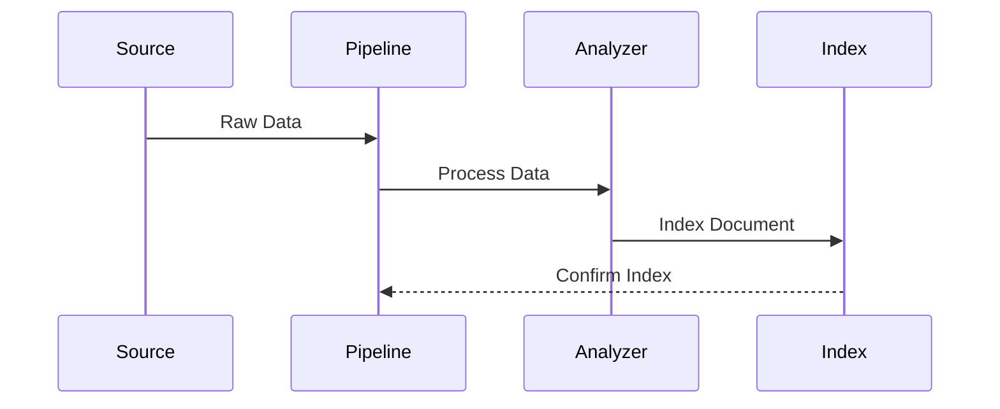
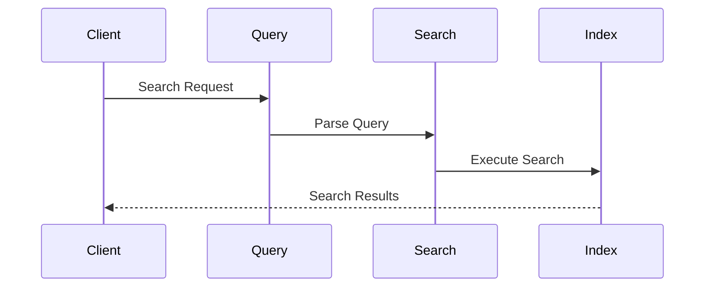
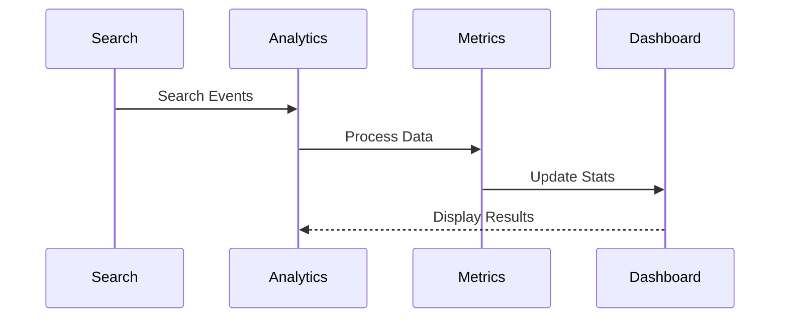

# Search and Indexing Architecture

## Overview

The Search Architecture provides a scalable and efficient search infrastructure built on Elasticsearch, offering advanced search capabilities, real-time indexing, and analytics features across the application.

Key Features:
- Full-text search
- Real-time indexing
- Faceted search
- Fuzzy matching
- Geospatial search
- Analytics and metrics

Benefits:
- Fast search response
- High availability
- Scalable architecture
- Rich query capabilities
- Detailed analytics

## Components

### Search Engine
1. Elasticsearch Core
   - Index management
   - Sharding strategy
   - Replication setup
   - Query processing

2. Query Engine
   - Full-text search
   - Fuzzy matching
   - Faceted search
   - Query DSL

3. Ranking System
   - Relevance scoring
   - Field boosting
   - Custom scoring
   - Popularity factors

### Data Processing
1. Indexing Pipeline
   - Text analysis
   - Tokenization
   - Filter chains
   - Normalization

2. ETL Pipeline
   - Data extraction
   - Transformation
   - Loading strategy
   - Validation

3. Optimization Layer
   - Search caching
   - Suggestion engine
   - Synonym expansion
   - Query optimization

## Interactions

The search system follows these key workflows:

1. Indexing Flow


2. Search Flow


3. Analytics Flow


## Implementation Details

### Search Manager Implementation
```typescript
interface SearchConfig {
  indices: IndexConfig[];
  shards: number;
  replicas: number;
  analyzers: AnalyzerConfig[];
}

class SearchManager {
  private config: SearchConfig;
  private client: ElasticsearchClient;
  private analyzer: TextAnalyzer;
  
  constructor(config: SearchConfig) {
    this.config = config;
    this.client = new ElasticsearchClient();
    this.analyzer = new TextAnalyzer();
  }
  
  async search<T>(
    query: SearchQuery,
    options: SearchOptions
  ): Promise<SearchResult<T>> {
    const parsedQuery = await this.parseQuery(query);
    const results = await this.executeSearch(
      parsedQuery,
      options
    );
    
    return this.processResults(results);
  }
  
  private async parseQuery(
    query: SearchQuery
  ): Promise<ParsedQuery> {
    return this.analyzer.parse(query);
  }
}
```

### Indexing Manager Implementation
```typescript
interface IndexConfig {
  name: string;
  mappings: IndexMapping[];
  settings: IndexSettings;
  aliases: string[];
}

class IndexManager {
  private config: IndexConfig;
  private pipeline: IndexPipeline;
  private validator: DocumentValidator;
  
  constructor(config: IndexConfig) {
    this.config = config;
    this.pipeline = new IndexPipeline();
    this.validator = new DocumentValidator();
  }
  
  async index<T>(
    document: T,
    options?: IndexOptions
  ): Promise<IndexResult> {
    const validated = await this.validator.validate(
      document
    );
    
    const processed = await this.pipeline.process(
      validated,
      options
    );
    
    return this.indexDocument(processed);
  }
  
  private async indexDocument(
    document: ProcessedDocument
  ): Promise<IndexResult> {
    const operation = await this.prepareIndex(
      document
    );
    
    return this.executeOperation(operation);
  }
}
```

### Analytics Manager Implementation
```typescript
interface AnalyticsConfig {
  metrics: MetricConfig[];
  aggregations: AggregationConfig[];
  reporting: ReportConfig;
}

class SearchAnalytics {
  private config: AnalyticsConfig;
  private collector: MetricCollector;
  private reporter: AnalyticsReporter;
  
  constructor(config: AnalyticsConfig) {
    this.config = config;
    this.collector = new MetricCollector();
    this.reporter = new AnalyticsReporter();
  }
  
  async trackSearch(
    event: SearchEvent
  ): Promise<void> {
    await this.collector.collect(event);
    
    const metrics = await this.processMetrics(
      event
    );
    
    await this.updateDashboard(metrics);
  }
  
  private async processMetrics(
    event: SearchEvent
  ): Promise<SearchMetrics> {
    const data = await this.collector.query({
      event,
      period: this.config.reporting.period
    });
    
    return this.computeMetrics(data);
  }
}

## Search Architecture Diagram

```mermaid
graph TB
    subgraph "Search Engine"
        subgraph "Elasticsearch"
            Index[Indices]
            Shards[Sharding]
            Replicas[Replication]
        end

        subgraph "Query Engine"
            FullText[Full Text Search]
            Fuzzy[Fuzzy Search]
            Faceted[Faceted Search]
        end

        subgraph "Ranking"
            Relevance[Relevance Score]
            Boost[Field Boost]
            Custom[Custom Scoring]
        end
    end

    subgraph "Data Processing"
        subgraph "Indexing"
            Analyzer[Text Analysis]
            Tokenizer[Tokenization]
            Filter[Filters]
        end

        subgraph "Pipeline"
            Extract[Data Extraction]
            Transform[Data Transform]
            Load[Data Loading]
        end

        subgraph "Optimization"
            Cache[Search Cache]
            Suggest[Suggestions]
            Synonyms[Synonyms]
        end
    end

    subgraph "Search Features"
        subgraph "Advanced"
            Aggregation[Aggregations]
            Highlight[Highlighting]
            Autocomplete[Autocomplete]
        end

        subgraph "Filters"
            Range[Range Filter]
            Geo[Geo Filter]
            Term[Term Filter]
        end

        subgraph "Analytics"
            Popular[Popular Terms]
            Trends[Search Trends]
            Metrics[Search Metrics]
        end
    end

    subgraph "Infrastructure"
        subgraph "Scaling"
            Cluster[ES Cluster]
            Balance[Load Balance]
            Backup[Backup/Recovery]
        end

        subgraph "Performance"
            Monitor[Monitoring]
            Tune[Performance Tune]
            Alert[Alerting]
        end

        subgraph "Security"
            Auth[Authentication]
            Access[Access Control]
            Audit[Audit Logs]
        end
    end

    %% Search Flow
    Index --> FullText
    Shards --> Fuzzy
    Replicas --> Faceted

    FullText --> Relevance
    Fuzzy --> Boost
    Faceted --> Custom

    %% Processing Flow
    Analyzer --> Extract
    Tokenizer --> Transform
    Filter --> Load

    Extract --> Cache
    Transform --> Suggest
    Load --> Synonyms

    %% Features Flow
    Aggregation --> Range
    Highlight --> Geo
    Autocomplete --> Term

    Range --> Popular
    Geo --> Trends
    Term --> Metrics

    %% Infrastructure Flow
    Cluster --> Monitor
    Balance --> Tune
    Backup --> Alert

    Monitor --> Auth
    Tune --> Access
    Alert --> Audit
```



## Component Description

### Search Engine

1. **Elasticsearch**

   - Index management
   - Sharding strategy
   - Replication setup

2. **Query Engine**

   - Full-text search
   - Fuzzy matching
   - Faceted search

3. **Ranking System**
   - Relevance scoring
   - Field boosting
   - Custom scoring

### Data Processing

1. **Indexing Pipeline**

   - Text analysis
   - Tokenization
   - Filter chain

2. **ETL Process**
   - Data extraction
   - Transformation
   - Loading strategy

## Implementation Guidelines

1. **Index Design**

   - Schema design
   - Mapping config
   - Analysis chain
   - Field types

2. **Search Features**

   - Query types
   - Filter options
   - Aggregations
   - Highlighting

3. **Performance**

   - Caching strategy
   - Query optimization
   - Index optimization
   - Cluster setup

4. **Best Practices**

   - Index lifecycle
   - Query patterns
   - Bulk operations
   - Error handling

5. **Monitoring**

   - Performance metrics
   - Search analytics
   - Health checks
   - Alerts

6. **Documentation**
   - Index schemas
   - Query patterns
   - API endpoints
   - Best practices
