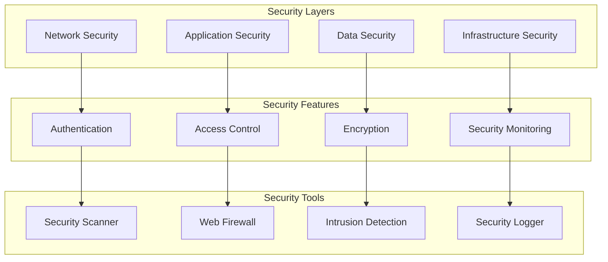
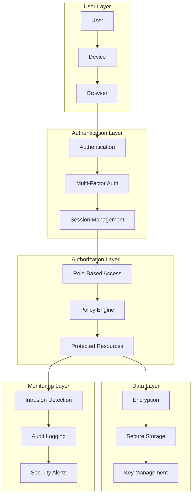

# Security Architecture

This document outlines our comprehensive security implementation and best practices.

## Overview

Our security architecture implements a comprehensive, defense-in-depth approach to protect our systems, data, and users. It follows the principle of least privilege and employs multiple layers of security controls including authentication, authorization, encryption, and monitoring. The architecture is designed to meet industry compliance requirements while maintaining system performance and user experience.

## Implementation

Our security system utilizes several particle components from our [Atomic Design Structure](../../components/atomic-design.md#particles):

- Security Context Providers for security state
- Error Boundary particles for security errors
- Event Handler particles for security events
- Performance Optimizers for security checks

## Security Architecture Diagram



## Security Components

### 1. Network Security

- TLS/SSL
- DDoS protection
- IP filtering
- Rate limiting

### 2. Application Security

- Input validation
- Output encoding
- Session management
- CSRF protection

### 3. Data Security

- Encryption at rest
- Encryption in transit
- Key management
- Data masking

### 4. Infrastructure Security

- Container security
- Cloud security
- CI/CD security
- Secrets management

## Implementation Patterns

### Security Context

```typescript
// Security context provider particle
const SecurityProvider = ({ children }: PropsWithChildren) => {
  const [securityState, setSecurityState] = useState({
    csrfToken: null,
    securityLevel: 'high',
    encryptionEnabled: true,
  });

  return <SecurityContext.Provider value={securityState}>{children}</SecurityContext.Provider>;
};
```

### Security Monitoring

```typescript
// Security monitor particle
const SecurityMonitor = ({ onSecurityEvent, children }: SecurityMonitorProps) => {
  useEffect(() => {
    const monitor = new SecurityEventMonitor();
    monitor.onEvent(onSecurityEvent);
    return () => monitor.disconnect();
  }, [onSecurityEvent]);

  return children;
};
```

### Security Error Handling

```typescript
// Security error boundary particle
const SecurityErrorBoundary = ({ onError, children }: SecurityErrorBoundaryProps) => {
  return (
    <ErrorBoundary
      fallback={<SecurityIncident />}
      onError={(error) => {
        if (isSecurityError(error)) {
          onError(error);
        }
      }}
    >
      {children}
    </ErrorBoundary>
  );
};
```

## Components

### 1. Authentication Layer
- **Identity Management**
  - User registration
  - Password policies
  - Multi-factor authentication
  - Social authentication
- **Session Management**
  - Token generation
  - Session validation
  - Session expiration
  - Token refresh
- **Access Protocols**
  - OAuth 2.0
  - OpenID Connect
  - SAML
  - JWT

### 2. Authorization Layer
- **Access Control**
  - Role-based access (RBAC)
  - Attribute-based access (ABAC)
  - Policy enforcement
  - Permission management
- **Resource Protection**
  - API security
  - Service mesh
  - Network policies
  - Rate limiting
- **Data Access**
  - Data classification
  - Access levels
  - Audit logging
  - Data masking

### 3. Encryption Layer
- **Data Protection**
  - At-rest encryption
  - In-transit encryption
  - End-to-end encryption
  - Key management
- **Certificate Management**
  - SSL/TLS certificates
  - Certificate rotation
  - PKI infrastructure
  - Key storage
- **Secure Communication**
  - HTTPS
  - TLS 1.3
  - Perfect forward secrecy
  - Protocol security

### 4. Security Monitoring
- **Threat Detection**
  - Intrusion detection
  - Anomaly detection
  - Vulnerability scanning
  - Security analytics
- **Incident Response**
  - Alert management
  - Incident tracking
  - Response automation
  - Post-mortem analysis
- **Compliance Monitoring**
  - Audit trails
  - Compliance reporting
  - Policy enforcement
  - Risk assessment

## Interactions

### 1. Security Flow


### 2. Authentication Flow
1. User initiates login
2. Credentials validated
3. MFA challenge issued
4. MFA validated
5. Session token generated
6. Access granted
7. Session monitored

### 3. Authorization Flow
1. Request received
2. Session validated
3. Permissions checked
4. Policies evaluated
5. Access decision made
6. Action logged
7. Response returned

## Implementation Details

### 1. Authentication Implementation

```typescript
// Authentication configuration
interface AuthConfig {
  providers: AuthProvider[];
  mfa: MFAConfig;
  session: SessionConfig;
  password: PasswordPolicy;
}

interface AuthProvider {
  type: 'oauth' | 'oidc' | 'saml';
  config: ProviderConfig;
}

// Authentication implementation
class AuthenticationManager {
  private config: AuthConfig;
  private providers: Map<string, AuthProvider>;
  private mfa: MFAManager;

  constructor(config: AuthConfig) {
    this.config = config;
    this.providers = new Map();
    this.mfa = new MFAManager(config.mfa);
  }

  public async authenticate(
    credentials: Credentials
  ): Promise<AuthResult> {
    const user = await this.validateCredentials(credentials);
    const mfaResult = await this.mfa.challenge(user);
    return this.createSession(user, mfaResult);
  }

  private async validateCredentials(
    credentials: Credentials
  ): Promise<User> {
    const provider = this.getProvider(credentials.type);
    return provider.validate(credentials);
  }

  private async createSession(
    user: User,
    mfa: MFAResult
  ): Promise<Session> {
    const session = await this.sessionManager.create(user);
    await this.auditLogger.logAuth(user, session);
    return session;
  }
}
```

### 2. Authorization Implementation

```typescript
// Authorization configuration
interface AuthorizationConfig {
  rbac: RBACConfig;
  policies: PolicyConfig;
  resources: ResourceConfig;
}

interface PolicyConfig {
  rules: PolicyRule[];
  enforcement: EnforcementMode;
  caching: CacheConfig;
}

// Authorization implementation
class AuthorizationManager {
  private config: AuthorizationConfig;
  private policyEngine: PolicyEngine;
  private rbac: RBACManager;

  constructor(config: AuthorizationConfig) {
    this.config = config;
    this.policyEngine = new PolicyEngine(config.policies);
    this.rbac = new RBACManager(config.rbac);
  }

  public async authorize(
    request: AuthzRequest
  ): Promise<AuthzResult> {
    const subject = await this.getSubject(request);
    const resource = await this.getResource(request);
    return this.evaluateAccess(subject, resource);
  }

  private async evaluateAccess(
    subject: Subject,
    resource: Resource
  ): Promise<Decision> {
    const roles = await this.rbac.getRoles(subject);
    const policies = await this.policyEngine.getPolicies(resource);
    return this.policyEngine.evaluate(roles, policies);
  }

  private async auditAccess(
    decision: Decision,
    context: AuthzContext
  ): Promise<void> {
    await this.auditLogger.logAccess(decision, context);
  }
}
```

### 3. Encryption Implementation

```typescript
// Encryption configuration
interface EncryptionConfig {
  algorithms: AlgorithmConfig;
  keys: KeyConfig;
  storage: StorageConfig;
}

interface KeyConfig {
  rotation: RotationPolicy;
  storage: KeyStorageConfig;
  backup: BackupConfig;
}

// Encryption implementation
class EncryptionManager {
  private config: EncryptionConfig;
  private keyManager: KeyManager;
  private storage: SecureStorage;

  constructor(config: EncryptionConfig) {
    this.config = config;
    this.keyManager = new KeyManager(config.keys);
    this.storage = new SecureStorage(config.storage);
  }

  public async encrypt(
    data: Buffer,
    context: EncryptionContext
  ): Promise<EncryptedData> {
    const key = await this.keyManager.getKey(context);
    const encrypted = await this.performEncryption(data, key);
    await this.auditEncryption(context);
    return encrypted;
  }

  private async performEncryption(
    data: Buffer,
    key: CryptoKey
  ): Promise<EncryptedData> {
    const iv = await this.generateIV();
    const ciphertext = await this.cipher.encrypt(data, key, iv);
    return { ciphertext, iv };
  }

  private async rotateKeys(): Promise<void> {
    const keys = await this.keyManager.listKeys();
    for (const key of keys) {
      await this.keyManager.rotateKey(key);
    }
  }
}
```

## Best Practices

1. **Defense in Depth**

   - Multiple security layers
   - Secure defaults
   - Fail securely
   - Least privilege

2. **Security Monitoring**

   - Real-time alerts
   - Audit logging
   - Incident response
   - Security metrics

3. **Compliance**
   - Data protection
   - Privacy compliance
   - Security standards
   - Regular audits

4. **Authentication**
   - Strong password policies
   - Multi-factor authentication
   - Regular session rotation
   - Secure credential storage
   - Failed attempt limiting
   - Account recovery process

5. **Authorization**
   - Least privilege principle
   - Regular access review
   - Policy-based access
   - Resource isolation
   - Clear audit trails
   - Zero trust approach

6. **Encryption**
   - Strong algorithms
   - Regular key rotation
   - Secure key storage
   - Perfect forward secrecy
   - Data classification
   - Encryption at rest/transit

## Related Documentation

- [Authentication Flow](./authentication.md)
- [Authorization Model](./authorization.md)
- [Encryption Standards](./encryption.md)
- [Security Monitoring](./monitoring.md)
- [Incident Response](./incident-response.md)
- [Data Protection](../data-flow/data-protection.md)
