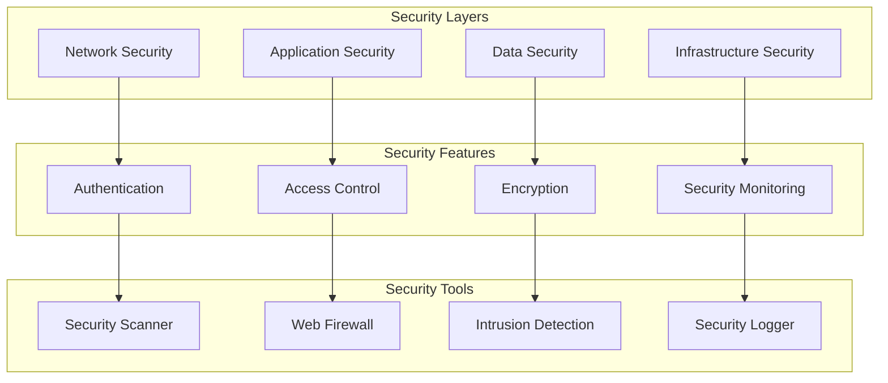

# Security Architecture

This document outlines our comprehensive security implementation and best practices.

## Implementation

Our security system utilizes several particle components from our [Atomic Design Structure](../../components/atomic-design.md#particles):

- Security Context Providers for security state
- Error Boundary particles for security errors
- Event Handler particles for security events
- Performance Optimizers for security checks

## Security Architecture Diagram



## Security Components

### 1. Network Security

- TLS/SSL
- DDoS protection
- IP filtering
- Rate limiting

### 2. Application Security

- Input validation
- Output encoding
- Session management
- CSRF protection

### 3. Data Security

- Encryption at rest
- Encryption in transit
- Key management
- Data masking

### 4. Infrastructure Security

- Container security
- Cloud security
- CI/CD security
- Secrets management

## Implementation Patterns

### Security Context

```typescript
// Security context provider particle
const SecurityProvider = ({ children }: PropsWithChildren) => {
  const [securityState, setSecurityState] = useState({
    csrfToken: null,
    securityLevel: 'high',
    encryptionEnabled: true,
  });

  return <SecurityContext.Provider value={securityState}>{children}</SecurityContext.Provider>;
};
```

### Security Monitoring

```typescript
// Security monitor particle
const SecurityMonitor = ({ onSecurityEvent, children }: SecurityMonitorProps) => {
  useEffect(() => {
    const monitor = new SecurityEventMonitor();
    monitor.onEvent(onSecurityEvent);
    return () => monitor.disconnect();
  }, [onSecurityEvent]);

  return children;
};
```

### Security Error Handling

```typescript
// Security error boundary particle
const SecurityErrorBoundary = ({ onError, children }: SecurityErrorBoundaryProps) => {
  return (
    <ErrorBoundary
      fallback={<SecurityIncident />}
      onError={(error) => {
        if (isSecurityError(error)) {
          onError(error);
        }
      }}
    >
      {children}
    </ErrorBoundary>
  );
};
```

## Best Practices

1. **Defense in Depth**

   - Multiple security layers
   - Secure defaults
   - Fail securely
   - Least privilege

2. **Security Monitoring**

   - Real-time alerts
   - Audit logging
   - Incident response
   - Security metrics

3. **Compliance**
   - Data protection
   - Privacy compliance
   - Security standards
   - Regular audits

## Related Documentation

- [Authentication Flow](../security/authentication.md)
- [Authorization Model](../security/authorization.md)
- [Data Protection](../data-flow/data-protection.md)
