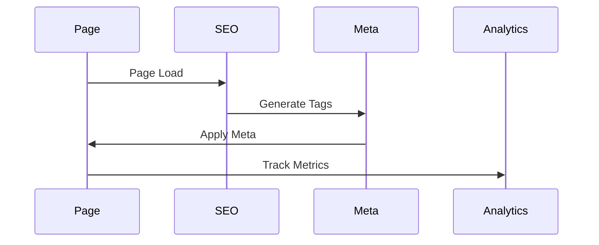
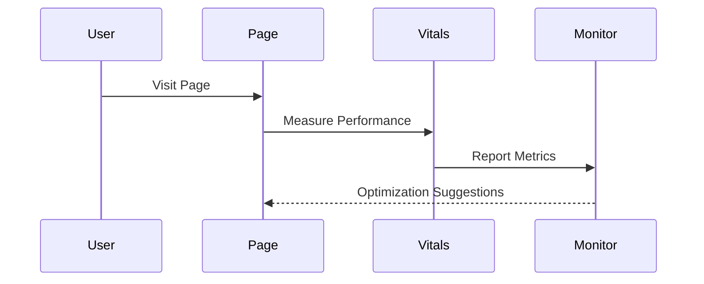
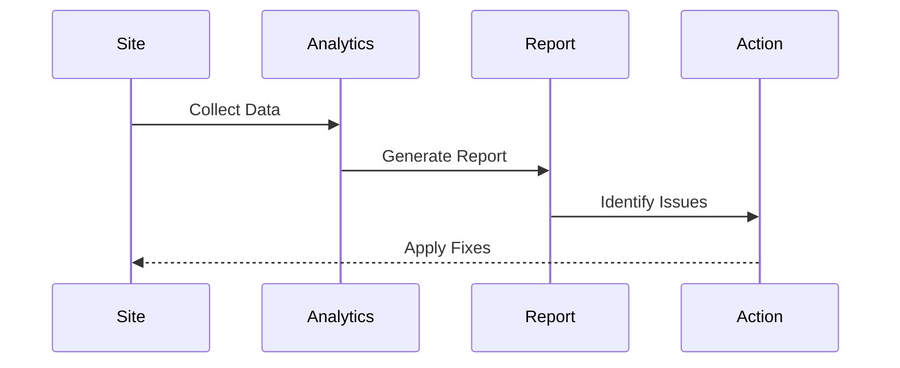
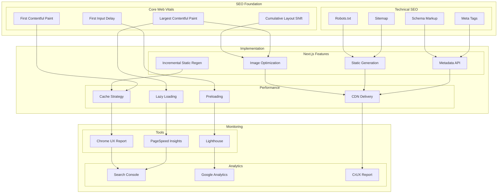

# SEO and Web Vitals Architecture

## Overview

The SEO and Web Vitals Architecture provides a comprehensive system for optimizing search engine visibility and user experience metrics. This architecture implements best practices for technical SEO, performance optimization, and monitoring.

Key Features:
- Technical SEO optimization
- Core Web Vitals management
- Performance monitoring
- Automated optimization
- Real-time analytics

Benefits:
- Better search rankings
- Improved user experience
- Higher conversion rates
- Enhanced visibility
- Performance insights

## Components

### Technical SEO
1. Meta Tags
   - Title optimization
   - Description management
   - Open Graph tags
   - Twitter cards

2. Schema Markup
   - JSON-LD implementation
   - Rich snippets
   - Breadcrumbs
   - Site structure

3. Sitemap & Robots
   - Dynamic sitemap
   - Priority settings
   - Crawl directives
   - Access control

### Core Web Vitals
1. Loading Performance
   - LCP optimization
   - FCP improvement
   - Resource prioritization
   - Critical path rendering

2. Interactivity
   - FID optimization
   - TTI improvement
   - Event handling
   - Resource loading

3. Visual Stability
   - CLS prevention
   - Layout stability
   - Asset dimensions
   - Font loading

## Interactions

The SEO system follows these key workflows:

1. Page Optimization Flow


2. Core Web Vitals Flow


3. Monitoring Flow


## Implementation Details

### SEO Manager Implementation
```typescript
interface SEOConfig {
  meta: MetaConfig;
  schema: SchemaConfig;
  monitoring: MonitorConfig;
}

class SEOManager {
  private config: SEOConfig;
  private meta: MetaGenerator;
  private schema: SchemaGenerator;
  
  constructor(config: SEOConfig) {
    this.config = config;
    this.meta = new MetaGenerator();
    this.schema = new SchemaGenerator();
  }
  
  async optimize(
    page: PageData,
    options?: OptimizeOptions
  ): Promise<SEOResult> {
    const meta = await this.generateMeta(page);
    const schema = await this.generateSchema(page);
    
    return this.applyOptimizations(
      page,
      meta,
      schema
    );
  }
  
  private async generateMeta(
    page: PageData
  ): Promise<MetaTags> {
    return this.meta.generate({
      title: page.title,
      description: page.description,
      url: page.url,
      image: page.image
    });
  }
}
```

### Web Vitals Implementation
```typescript
interface VitalsConfig {
  thresholds: ThresholdConfig;
  reporting: ReportConfig;
  optimization: OptimizeConfig;
}

class WebVitals {
  private config: VitalsConfig;
  private monitor: VitalsMonitor;
  private optimizer: VitalsOptimizer;
  
  constructor(config: VitalsConfig) {
    this.config = config;
    this.monitor = new VitalsMonitor();
    this.optimizer = new VitalsOptimizer();
  }
  
  async measure(
    page: PageData
  ): Promise<VitalsMetrics> {
    const metrics = await this.monitor.collect(page);
    await this.reportMetrics(metrics);
    
    if (this.needsOptimization(metrics)) {
      await this.optimize(page, metrics);
    }
    
    return metrics;
  }
  
  private needsOptimization(
    metrics: VitalsMetrics
  ): boolean {
    return Object.entries(metrics).some(
      ([metric, value]) => 
        value > this.config.thresholds[metric]
    );
  }
}
```

### Analytics Implementation
```typescript
interface AnalyticsConfig {
  tracking: TrackingConfig;
  reporting: ReportConfig;
  alerts: AlertConfig;
}

class SEOAnalytics {
  private config: AnalyticsConfig;
  private tracker: MetricsTracker;
  private reporter: AnalyticsReporter;
  
  constructor(config: AnalyticsConfig) {
    this.config = config;
    this.tracker = new MetricsTracker();
    this.reporter = new AnalyticsReporter();
  }
  
  async track(
    event: SEOEvent
  ): Promise<void> {
    await this.tracker.record(event);
    
    const metrics = await this.processMetrics(
      event
    );
    
    if (this.shouldAlert(metrics)) {
      await this.sendAlert(metrics);
    }
  }
  
  private shouldAlert(
    metrics: SEOMetrics
  ): boolean {
    return metrics.score < 
      this.config.alerts.threshold;
  }
}
```

## SEO Architecture Diagram



## Component Description

### SEO Foundation

1. **Technical SEO**

   - Meta tag management
   - Schema.org markup
   - XML sitemap
   - Robots.txt config

2. **Core Web Vitals**
   - LCP optimization
   - FID improvement
   - CLS prevention
   - FCP optimization

### Implementation

1. **Next.js Features**

   - Metadata API usage
   - ISR implementation
   - Static generation
   - Image optimization

2. **Performance**
   - Lazy loading strategy
   - Resource preloading
   - Cache management
   - CDN configuration

### Monitoring

1. **Analytics Tools**

   - Search Console integration
   - Analytics setup
   - CrUX monitoring

2. **Performance Tools**
   - Lighthouse audits
   - UX reporting
   - PageSpeed monitoring

## Implementation Guidelines

1. **SEO Strategy**

   - Meta tag standards
   - Schema implementation
   - URL structure
   - Content hierarchy

2. **Performance Optimization**

   - Image optimization
   - Font loading
   - Script loading
   - Style delivery

3. **Monitoring Setup**

   - Regular audits
   - Performance tracking
   - Search analytics
   - User behavior

4. **Best Practices**

   - Mobile optimization
   - Content structure
   - Performance budgets
   - Regular monitoring

5. **Documentation**
   - SEO guidelines
   - Performance targets
   - Monitoring procedures
   - Optimization tips
