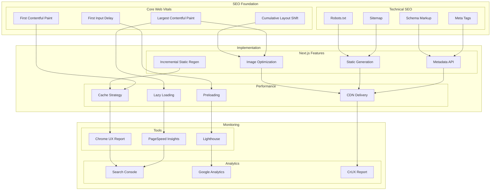

# SEO and Web Vitals Architecture

This diagram illustrates our comprehensive SEO strategy and Core Web Vitals optimization approach.

## SEO Architecture Diagram

## Component Description

### SEO Foundation

1. **Technical SEO**

   - Meta tag management
   - Schema.org markup
   - XML sitemap
   - Robots.txt config

2. **Core Web Vitals**
   - LCP optimization
   - FID improvement
   - CLS prevention
   - FCP optimization

### Implementation

1. **Next.js Features**

   - Metadata API usage
   - ISR implementation
   - Static generation
   - Image optimization

2. **Performance**
   - Lazy loading strategy
   - Resource preloading
   - Cache management
   - CDN configuration

### Monitoring

1. **Analytics Tools**

   - Search Console integration
   - Analytics setup
   - CrUX monitoring

2. **Performance Tools**
   - Lighthouse audits
   - UX reporting
   - PageSpeed monitoring

## Implementation Guidelines

1. **SEO Strategy**

   - Meta tag standards
   - Schema implementation
   - URL structure
   - Content hierarchy

2. **Performance Optimization**

   - Image optimization
   - Font loading
   - Script loading
   - Style delivery

3. **Monitoring Setup**

   - Regular audits
   - Performance tracking
   - Search analytics
   - User behavior

4. **Best Practices**

   - Mobile optimization
   - Content structure
   - Performance budgets
   - Regular monitoring

5. **Documentation**
   - SEO guidelines
   - Performance targets
   - Monitoring procedures
   - Optimization tips
