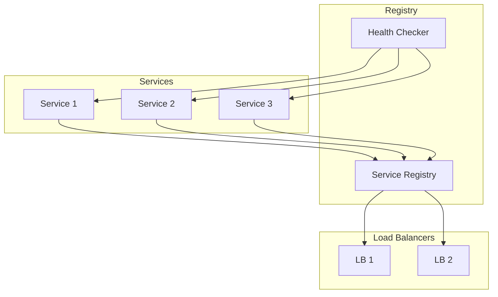

# Service Discovery Architecture

This diagram illustrates our service discovery architecture, including service registry, health checking, and load balancing components.

## Components

### Service Registry

- Maintains service inventory
- Handles service registration
- Provides service discovery
- Updates load balancers

### Health Checker

- Monitors service health
- Performs periodic checks
- Reports service status
- Triggers failover

### Load Balancers

- Distribute traffic
- Handle failover
- Maintain service lists
- Update routing tables

## Implementation Details

### Service Registration

- Automatic registration
- Health check endpoints
- Metadata management
- Version tracking

### Health Monitoring

- Regular health checks
- Custom health metrics
- Failure detection
- Recovery monitoring

### Load Balancing

- Round-robin distribution
- Health-aware routing
- Automatic failover
- Load distribution
