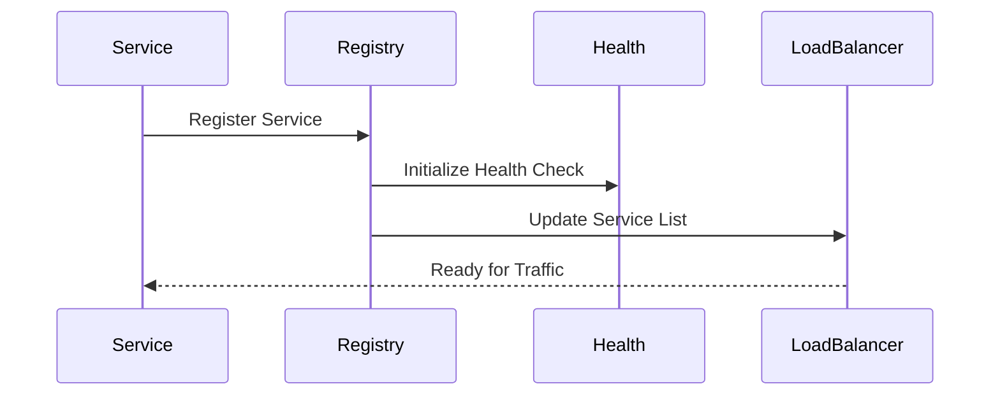
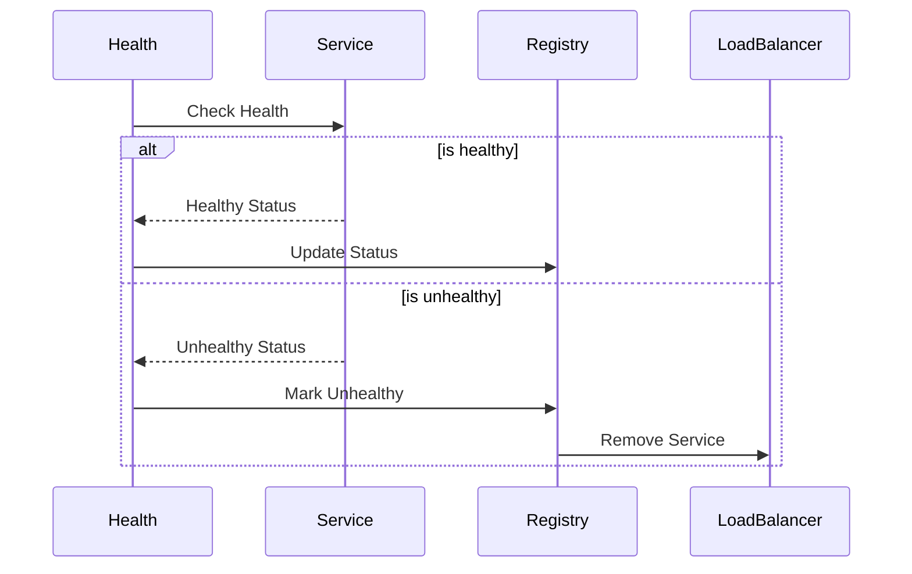
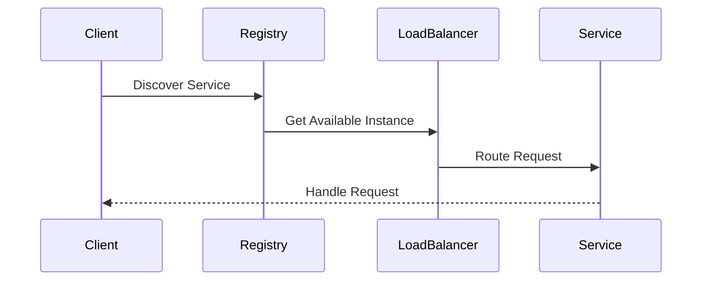
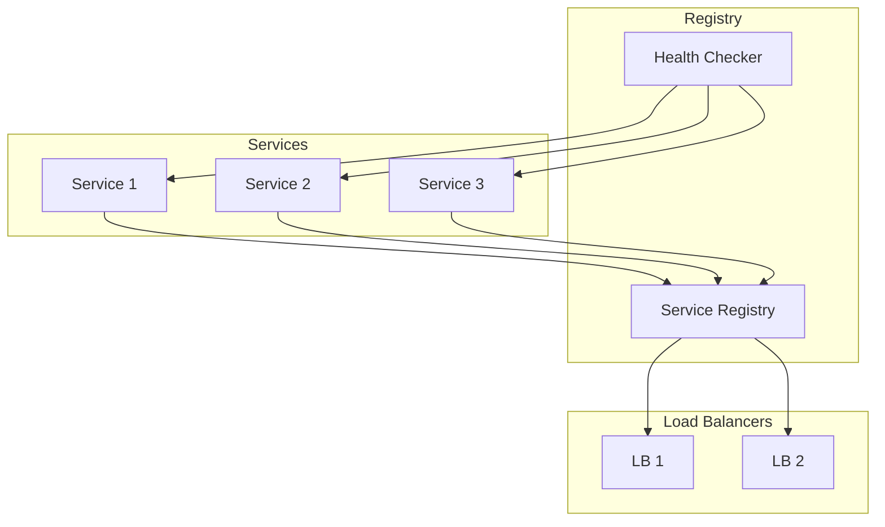

# Service Discovery Architecture

## Overview

The Service Discovery Architecture provides a robust and scalable solution for service registration, health monitoring, and load balancing in our distributed system. This architecture enables automatic service registration, real-time health monitoring, and intelligent load distribution across multiple service instances.

Key Features:
- Automatic service registration
- Real-time health monitoring
- Dynamic load balancing
- Failover management
- Service metadata management

Benefits:
- High availability
- Automatic scaling
- Reduced downtime
- Simplified deployment
- Enhanced reliability

## Interactions

The service discovery system follows these key workflows:

1. Service Registration Flow

2. Health Check Flow

3. Service Discovery Flow

This diagram illustrates our service discovery architecture, including service registry, health checking, and load balancing components.

## Components

### Service Registry

- Maintains service inventory
- Handles service registration
- Provides service discovery
- Updates load balancers

### Health Checker

- Monitors service health
- Performs periodic checks
- Reports service status
- Triggers failover

### Load Balancers

- Distribute traffic
- Handle failover
- Maintain service lists
- Update routing tables

## Implementation Details

### Service Registration

- Automatic registration
- Health check endpoints
- Metadata management
- Version tracking

### Health Monitoring

- Regular health checks
- Custom health metrics
- Failure detection
- Recovery monitoring

### Load Balancing

- Round-robin distribution
- Health-aware routing
- Automatic failover
- Load distribution
