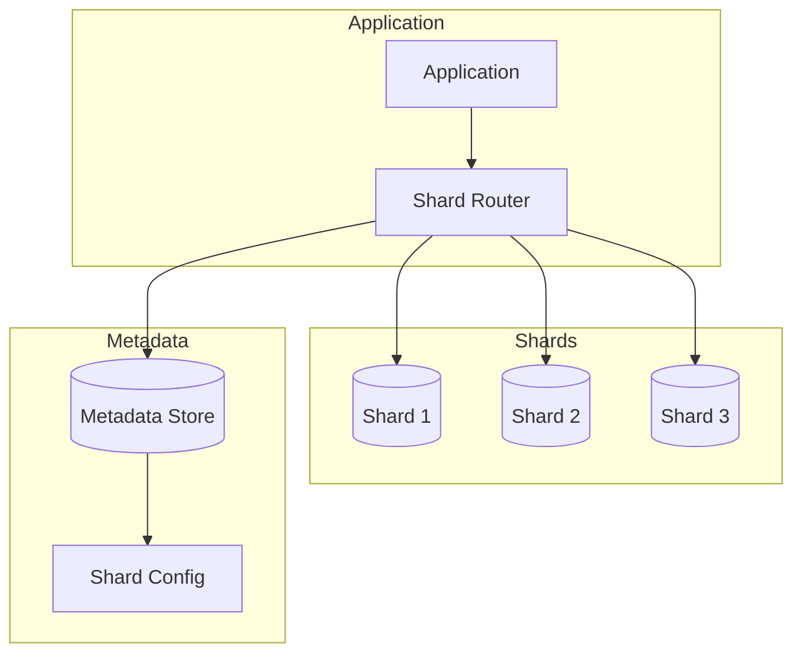

# Database Sharding Architecture

This diagram illustrates our database sharding strategy, including the shard router, individual shards, and metadata management.

## Components

### Shard Router

- Routes queries to appropriate shards
- Handles shard key calculation
- Manages cross-shard queries

### Shards

- Independent database instances
- Horizontally partitioned data
- Consistent schema across shards

### Metadata Store

- Stores shard mapping information
- Manages shard configuration
- Handles shard rebalancing

## Sharding Strategy

### Shard Key Selection

- Based on business requirements
- Ensures even data distribution
- Minimizes cross-shard queries

### Data Distribution

- Hash-based sharding
- Range-based sharding
- Directory-based sharding

### Rebalancing

- Automatic shard rebalancing
- Data migration between shards
- Zero-downtime rebalancing
