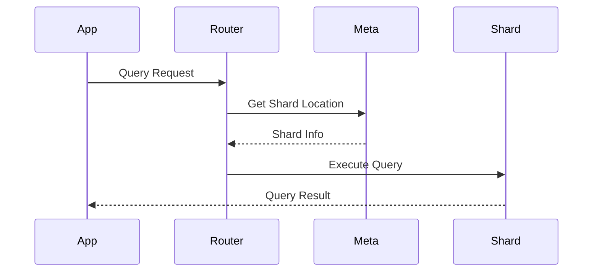
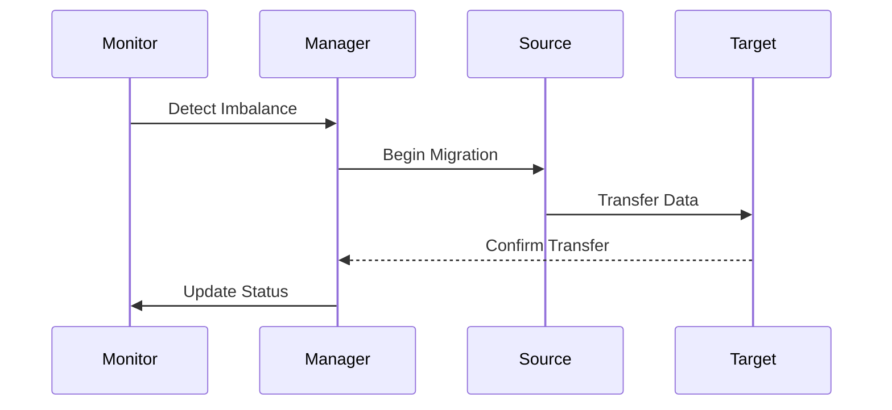
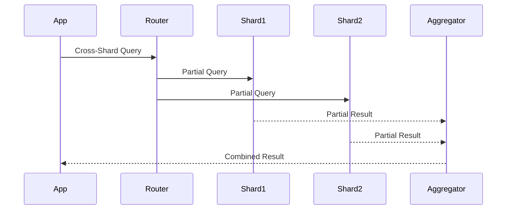

# Database Sharding Architecture

## Overview

The Database Sharding Architecture provides a scalable solution for distributing data across multiple database instances while maintaining data consistency and system performance. This architecture enables horizontal scaling, improved throughput, and better resource utilization through intelligent data partitioning and routing.

Key capabilities:
- Horizontal scalability through data partitioning
- Intelligent query routing
- Automated shard rebalancing
- High availability and fault tolerance
- Real-time performance monitoring

Benefits:
- Improved query performance
- Better resource utilization
- Reduced infrastructure costs
- Enhanced data locality
- Flexible scaling options

## Interactions

The sharding system follows these primary workflows:

1. Query Routing Flow


2. Shard Rebalancing Flow


3. Cross-Shard Query Flow


## Implementation Details

### Shard Router Implementation
```typescript
interface ShardConfig {
  shardKey: string;
  algorithm: 'hash' | 'range' | 'directory';
  replicaCount: number;
  consistencyLevel: 'strong' | 'eventual';
}

class ShardRouter {
  async routeQuery(query: Query, config: ShardConfig): Promise<QueryResult> {
    const shardKey = this.extractShardKey(query, config.shardKey);
    const shard = await this.locateShard(shardKey);
    
    if (this.isCrossShardQuery(query)) {
      return this.handleCrossShardQuery(query, shard);
    }
    
    return this.executeSingleShardQuery(query, shard);
  }
  
  private async locateShard(shardKey: string): Promise<Shard> {
    const shardMap = await this.metadataStore.getShardMap();
    return this.calculateTargetShard(shardKey, shardMap);
  }
}
```

### Rebalancing Manager Implementation
```typescript
interface RebalanceConfig {
  threshold: number;
  batchSize: number;
  maxConcurrent: number;
  timeWindow: number;
}

class ShardRebalancer {
  async rebalanceShards(config: RebalanceConfig): Promise<void> {
    const shards = await this.getShardMetrics();
    const plan = this.createRebalancePlan(shards, config);
    
    for (const migration of plan) {
      await this.executeMigration(migration, config);
      await this.updateMetadata(migration);
      await this.verifyMigration(migration);
    }
  }
  
  private async executeMigration(
    migration: Migration,
    config: RebalanceConfig
  ): Promise<void> {
    const batches = this.createBatches(migration.data, config.batchSize);
    
    for (const batch of batches) {
      await this.transferBatch(batch, migration.source, migration.target);
      await this.verifyBatch(batch, migration.target);
    }
  }
}
```

### Query Aggregator Implementation
```typescript
interface AggregationConfig {
  strategy: 'parallel' | 'sequential';
  timeout: number;
  retryCount: number;
}

class CrossShardAggregator {
  async aggregate(
    queries: Query[],
    config: AggregationConfig
  ): Promise<AggregatedResult> {
    const results = config.strategy === 'parallel'
      ? await this.executeParallel(queries, config)
      : await this.executeSequential(queries, config);
      
    return this.mergeResults(results);
  }
  
  private async executeParallel(
    queries: Query[],
    config: AggregationConfig
  ): Promise<QueryResult[]> {
    const executions = queries.map(query => 
      this.executeWithRetry(query, config.retryCount)
    );
    
    return Promise.all(executions);
  }
}

## Components

### Shard Router

- Routes queries to appropriate shards
- Handles shard key calculation
- Manages cross-shard queries

### Shards

- Independent database instances
- Horizontally partitioned data
- Consistent schema across shards

### Metadata Store

- Stores shard mapping information
- Manages shard configuration
- Handles shard rebalancing

## Sharding Strategy

### Shard Key Selection

- Based on business requirements
- Ensures even data distribution
- Minimizes cross-shard queries

### Data Distribution

- Hash-based sharding
- Range-based sharding
- Directory-based sharding

### Rebalancing

- Automatic shard rebalancing
- Data migration between shards
- Zero-downtime rebalancing

This diagram illustrates our database sharding strategy, including the shard router, individual shards, and metadata management.

```mermaid
graph TB
    subgraph "Application"
        App[Application]
        Router[Shard Router]
    end

    subgraph "Shards"
        S1[(Shard 1)]
        S2[(Shard 2)]
        S3[(Shard 3)]
    end

    subgraph "Metadata"
        MS[(Metadata Store)]
        Config[Shard Config]
    end

    App --> Router
    Router --> MS
    MS --> Config

    Router --> S1
    Router --> S2
    Router --> S3
