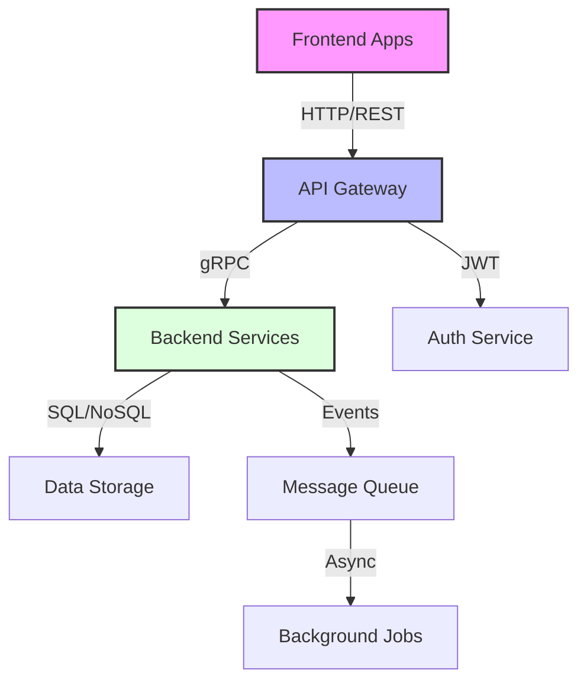

# Architecture Standards

## Overview

This document outlines the architectural standards and best practices that should be followed across all components and systems in our project.

## Components

### Core Components
- **Frontend Applications**: Next.js-based web applications
- **Backend Services**: Node.js microservices
- **Infrastructure**: Cloud-native deployment infrastructure
- **Data Storage**: Distributed database systems
- **Security Layer**: Authentication and authorization services

### Support Components
- **Monitoring**: Application and infrastructure monitoring
- **Logging**: Centralized logging system
- **CI/CD**: Automated build and deployment pipelines
- **Documentation**: Technical and architectural documentation

## Interactions

### Component Communication


### Communication Patterns
- REST APIs for client-server communication
- gRPC for internal service communication
- Event-driven architecture for asynchronous operations
- WebSocket for real-time updates

## Implementation Details

### Technology Stack
```typescript
// Example API Route Implementation
import { NextApiRequest, NextApiResponse } from 'next'
import { authenticate } from '@acme/auth'
import { validate } from '@acme/validation'

export default async function handler(
  req: NextApiRequest,
  res: NextApiResponse
) {
  try {
    // Authentication
    const user = await authenticate(req)
    
    // Input validation
    const data = await validate(req.body)
    
    // Business logic
    const result = await processRequest(data)
    
    // Response
    res.status(200).json(result)
  } catch (error) {
    handleError(error, res)
  }
}
```

### Best Practices
1. **Error Handling**
   - Use standardized error responses
   - Implement proper logging
   - Handle edge cases

2. **Performance**
   - Implement caching strategies
   - Use connection pooling
   - Optimize database queries

3. **Security**
   - Follow OWASP guidelines
   - Implement rate limiting
   - Use proper authentication

## Documentation Standards

### File Structure
- Every architecture document should follow the standard template
- Documents should be organized by domain (system, infrastructure, security, etc.)
- Use relative paths for cross-document references

### Content Guidelines
- Start with a clear overview section
- Include component diagrams using Mermaid
- Document interactions and data flows
- Provide implementation details with TypeScript examples
- Include error handling strategies
- Document performance considerations

### Diagram Standards
- Use Mermaid for all diagrams
- Follow consistent naming conventions
- Include clear labels and descriptions
- Document diagram relationships

## Code Standards

### TypeScript
- Use strict type checking
- Document interfaces and types
- Follow functional programming principles where applicable
- Implement proper error handling

### Testing
- Include unit tests for core functionality
- Document test scenarios
- Follow TDD practices where applicable

## Security Standards

### Authentication & Authorization
- Document security patterns
- Include access control matrices
- Define security boundaries

### Data Protection
- Document encryption standards
- Define data classification
- Outline compliance requirements

## Performance Standards

### Optimization
- Document performance targets
- Include monitoring strategies
- Define scaling approaches

### Resource Management
- Document resource limits
- Include capacity planning
- Define caching strategies

## Integration Standards

### API Design
- Follow REST/GraphQL best practices
- Document API versioning
- Include rate limiting strategies

### Event Handling
- Document event patterns
- Define retry strategies
- Include failure handling

## Monitoring Standards

### Observability
- Define logging standards
- Include metrics collection
- Document tracing approach

### Alerting
- Document alert thresholds
- Define incident response
- Include escalation paths

## Related Documentation
- [Security Architecture](../security/security-architecture.md)
- [Performance Guidelines](../infrastructure/performance.md)
- [API Standards](../system/api.md)
