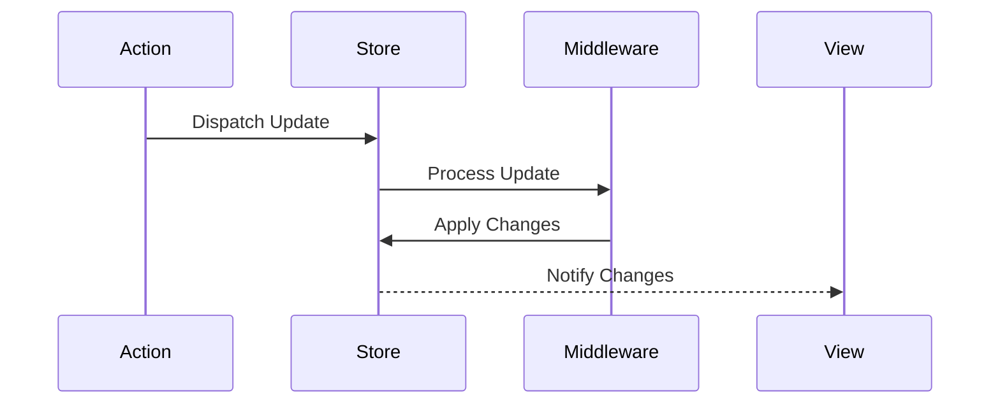
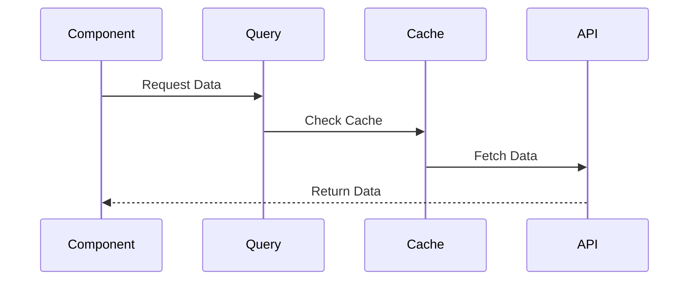
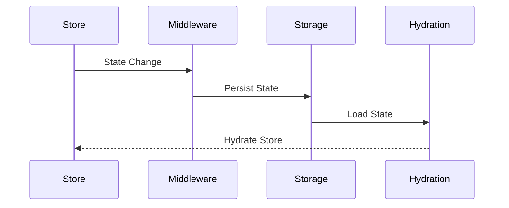
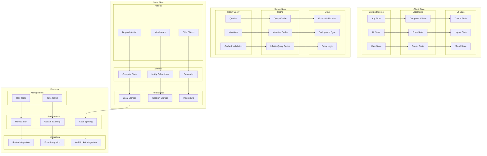

# State Management Architecture

## Overview

The State Management Architecture provides a robust and scalable solution for managing application state across client and server components. This architecture implements various state management patterns using Zustand for client state, React Query for server state, and specialized solutions for different state categories.

Key Features:
- Client state management
- Server state management
- State persistence
- Real-time updates
- Performance optimization

Benefits:
- Predictable state changes
- Improved performance
- Better debugging
- State synchronization
- Type-safe state

## Components

### Client State Components
1. Zustand Stores
   - App store
   - UI store
   - User store
   - Feature stores

2. Local State
   - Component state
   - Form state
   - Router state
   - Context state

3. UI State
   - Theme state
   - Layout state
   - Modal state
   - Navigation state

### Server State Components
1. React Query
   - Query management
   - Mutation handling
   - Cache invalidation
   - Background updates

2. Cache System
   - Query cache
   - Mutation cache
   - Infinite queries
   - Optimistic updates

3. Sync Management
   - Real-time sync
   - Offline support
   - Conflict resolution
   - Error recovery

## Interactions

The state management system follows these key workflows:

1. State Update Flow


2. Query Management Flow


3. State Persistence Flow


## Implementation Details

### Store Implementation
```typescript
interface StoreConfig<T> {
  name: string;
  initialState: T;
  middleware?: Middleware[];
  persist?: PersistConfig;
}

class Store<T extends State> {
  private state: T;
  private listeners: Set<Listener>;
  private middleware: Middleware[];
  
  constructor(config: StoreConfig<T>) {
    this.state = config.initialState;
    this.listeners = new Set();
    this.middleware = config.middleware ?? [];
    
    if (config.persist) {
      this.setupPersistence(config.persist);
    }
  }
  
  setState(
    updater: StateUpdater<T>,
    action?: Action
  ): void {
    const nextState = this.runMiddleware(
      updater(this.state),
      action
    );
    
    this.updateState(nextState);
    this.notifyListeners();
  }
  
  private runMiddleware(
    nextState: T,
    action?: Action
  ): T {
    return this.middleware.reduce(
      (state, middleware) => middleware(state, action),
      nextState
    );
  }
}
```

### Query Manager Implementation
```typescript
interface QueryConfig {
  cacheTime: number;
  staleTime: number;
  retry: RetryConfig;
  refetchOnMount: boolean;
}

class QueryManager {
  private cache: QueryCache;
  private config: QueryConfig;
  private subscribers: Map<string, QuerySubscriber[]>;
  
  constructor(config: QueryConfig) {
    this.cache = new QueryCache();
    this.config = config;
    this.subscribers = new Map();
  }
  
  async query<T>(
    key: QueryKey,
    fetcher: QueryFetcher<T>
  ): Promise<T> {
    const cached = this.cache.get(key);
    
    if (this.isValid(cached)) {
      return cached.data;
    }
    
    const data = await this.fetchAndCache(
      key,
      fetcher
    );
    
    this.notifySubscribers(key, data);
    return data;
  }
  
  private isValid(
    entry?: CacheEntry
  ): boolean {
    if (!entry) return false;
    
    const age = Date.now() - entry.timestamp;
    return age < this.config.staleTime;
  }
}
```

### Persistence Manager Implementation
```typescript
interface PersistConfig {
  key: string;
  storage: Storage;
  serialize?: Serializer;
  deserialize?: Deserializer;
  filter?: StateFilter;
}

class PersistenceManager<T> {
  private config: PersistConfig;
  private store: Store<T>;
  
  constructor(
    store: Store<T>,
    config: PersistConfig
  ) {
    this.store = store;
    this.config = config;
    this.initialize();
  }
  
  async persist(state: T): Promise<void> {
    const filtered = this.filterState(state);
    const serialized = this.serialize(filtered);
    
    await this.config.storage.setItem(
      this.config.key,
      serialized
    );
  }
  
  async hydrate(): Promise<Partial<T>> {
    const serialized = await this.config.storage.getItem(
      this.config.key
    );
    
    if (!serialized) {
      return {};
    }
    
    return this.deserialize(serialized);
  }
  
  private filterState(state: T): Partial<T> {
    if (!this.config.filter) {
      return state;
    }
    
    return this.config.filter(state);
  }
}
```

## State Management Diagram



## Component Description

### Client State

1. **Zustand Stores**

   - App-wide state
   - UI state
   - User state
   - Theme/preferences

2. **Local State**

   - Component state
   - Form state
   - Router state
   - Modal state

3. **UI State**
   - Theme settings
   - Layout config
   - Modal management
   - Navigation state

### Server State

1. **React Query**

   - Query management
   - Mutation handling
   - Cache invalidation
   - Background updates

2. **Caching**
   - Query caching
   - Mutation caching
   - Infinite queries
   - Prefetching

## Implementation Guidelines

1. **State Organization**

   - Store structure
   - State splitting
   - Action patterns
   - Side effects

2. **Performance**

   - Memoization
   - Re-render control
   - Code splitting
   - Bundle size

3. **Integration**

   - Router integration
   - Form handling
   - API integration
   - WebSocket sync

4. **Best Practices**

   - State immutability
   - Action creators
   - Middleware usage
   - Error handling

5. **Development**

   - DevTools setup
   - Time-travel debug
   - State persistence
   - Hot reloading

6. **Documentation**
   - Store structure
   - Action patterns
   - Integration guides
   - Best practices

## Related Documentation

- [State Architecture Overview](../data-flow/state-architecture.md)
- [Database Architecture](./database-architecture.md)
- [API Architecture](./api-architecture.md)
- [Real-time Communication](./realtime-architecture.md)
