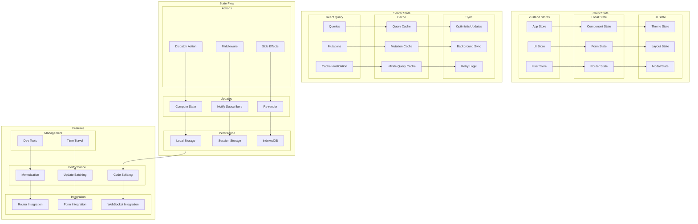

# State Management Architecture

This diagram illustrates our comprehensive state management strategy using Zustand, React Query, and other state management patterns.

## Related Documentation

- [State Architecture Overview](../data-flow/state-architecture.md)
- [Database Architecture](./database-architecture.md)
- [API Architecture](./api-architecture.md)
- [Real-time Communication](./realtime-architecture.md)

## State Management Diagram

## Component Description

### Client State

1. **Zustand Stores**

   - App-wide state
   - UI state
   - User state
   - Theme/preferences

2. **Local State**

   - Component state
   - Form state
   - Router state
   - Modal state

3. **UI State**
   - Theme settings
   - Layout config
   - Modal management
   - Navigation state

### Server State

1. **React Query**

   - Query management
   - Mutation handling
   - Cache invalidation
   - Background updates

2. **Caching**
   - Query caching
   - Mutation caching
   - Infinite queries
   - Prefetching

## Implementation Guidelines

1. **State Organization**

   - Store structure
   - State splitting
   - Action patterns
   - Side effects

2. **Performance**

   - Memoization
   - Re-render control
   - Code splitting
   - Bundle size

3. **Integration**

   - Router integration
   - Form handling
   - API integration
   - WebSocket sync

4. **Best Practices**

   - State immutability
   - Action creators
   - Middleware usage
   - Error handling

5. **Development**

   - DevTools setup
   - Time-travel debug
   - State persistence
   - Hot reloading

6. **Documentation**
   - Store structure
   - Action patterns
   - Integration guides
   - Best practices
