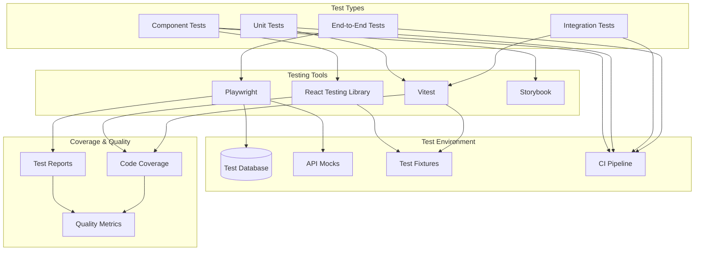

# Testing Architecture

This diagram illustrates our comprehensive testing strategy across different layers of the application, incorporating Playwright, Vitest, and other testing tools.

## Implementation

Our testing infrastructure utilizes several particle components from our [Atomic Design Structure](../components/atomic-design.md#particles):

- Test Wrapper particles for consistent test setup
- Mock Service Workers for API testing
- Context Providers for test configuration
- Performance Monitor wrappers for performance testing

## Testing Architecture Diagram

## Component Description

### Test Types

- **E2E Tests**: Full system testing with Playwright
- **Integration Tests**: Service integration testing
- **Unit Tests**: Individual function/module testing
- **Component Tests**: UI component testing

### Testing Tools

- **Playwright**: Browser automation and E2E testing
- **Vitest**: Fast unit and integration testing
- **React Testing Library**: Component testing
- **Storybook**: Component development and testing

### Test Environment

- **Test Database**: Isolated test data
- **API Mocks**: Service simulation
- **Test Fixtures**: Reusable test data
- **CI Pipeline**: Automated test execution

## Implementation Guidelines

1. **Test Organization**

   - Group tests by feature/module
   - Maintain clear test hierarchy
   - Follow naming conventions
   - Keep tests independent

2. **Test Coverage**

   - Unit test coverage targets
   - Integration test scenarios
   - E2E critical paths
   - Visual regression tests

3. **Best Practices**

   - Test isolation
   - Deterministic tests
   - Clear assertions
   - Meaningful error messages
   - Fast execution

4. **CI/CD Integration**

   - Automated test runs
   - Parallel execution
   - Test result reporting
   - Coverage tracking

5. **Maintenance**
   - Regular test reviews
   - Flaky test management
   - Performance monitoring
   - Documentation updates
