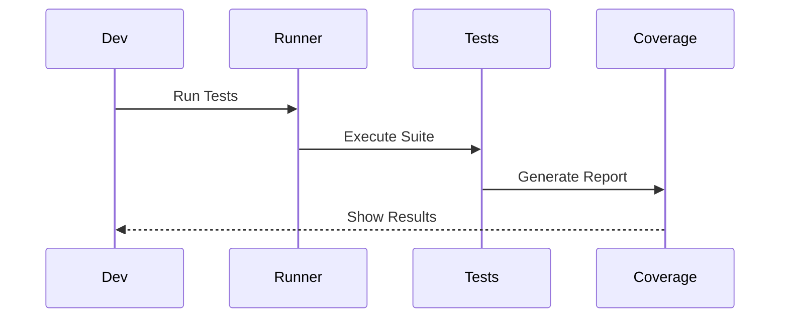
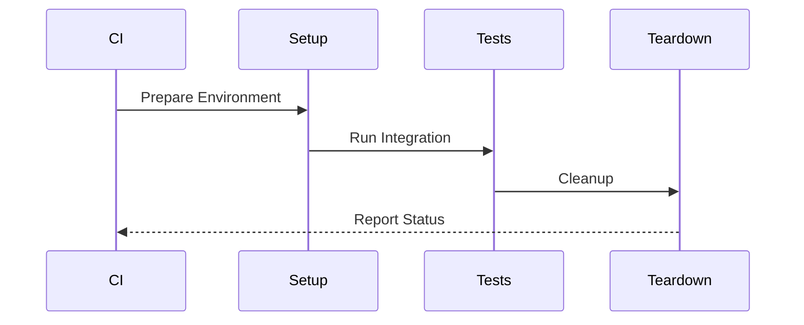
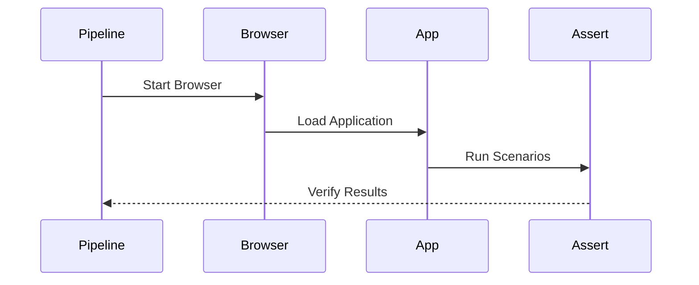
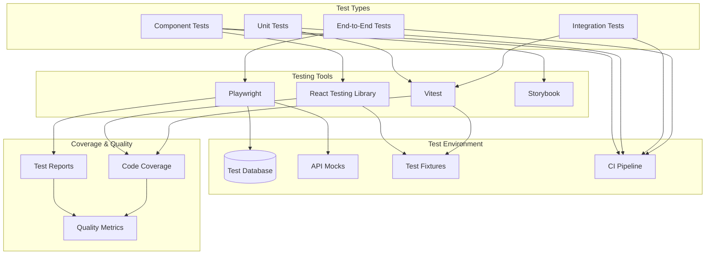

# Testing Architecture

## Overview

The Testing Architecture provides a comprehensive and scalable approach to testing across all layers of the application. This architecture implements various testing strategies including unit testing, integration testing, end-to-end testing, and component testing to ensure high quality and reliability of the system.

Key Features:
- Multi-level testing strategy
- Automated test execution
- Comprehensive coverage
- Performance testing
- Visual regression testing

Benefits:
- Improved code quality
- Faster development
- Reduced bugs
- Better maintainability
- Continuous validation

## Components

### Test Framework Components
1. Test Runners
   - Vitest configuration
   - Playwright setup
   - Jest integration
   - Custom runners

2. Test Utilities
   - Test helpers
   - Custom matchers
   - Mock factories
   - Fixtures manager

3. Assertion Libraries
   - Chai extensions
   - Custom matchers
   - Snapshot testing
   - API validators

### Environment Components
1. Test Infrastructure
   - CI/CD integration
   - Docker containers
   - Database setup
   - Network isolation

2. Mock Systems
   - API mocking
   - Service virtualization
   - Data generation
   - State management

3. Reporting Systems
   - Test reports
   - Coverage analysis
   - Performance metrics
   - Error tracking

## Interactions

The testing system follows these key workflows:

1. Unit Test Flow


2. Integration Test Flow


3. E2E Test Flow


## Implementation Details

### Test Runner Implementation
```typescript
interface TestConfig {
  runner: 'vitest' | 'jest';
  environment: 'node' | 'jsdom';
  coverage: {
    enabled: boolean;
    threshold: number;
  };
  timeout: number;
}

class TestRunner {
  private config: TestConfig;
  private reporters: TestReporter[];
  
  constructor(config: TestConfig) {
    this.config = config;
    this.reporters = this.setupReporters();
  }
  
  async runTests(
    pattern: string
  ): Promise<TestResults> {
    const suite = await this.loadTestSuite(pattern);
    const results = await this.executeTests(suite);
    
    this.reporters.forEach(reporter => 
      reporter.report(results)
    );
    
    return results;
  }
  
  private async executeTests(
    suite: TestSuite
  ): Promise<TestResults> {
    const runner = this.getRunner();
    return runner.run(suite);
  }
}
```

### Mock Service Implementation
```typescript
interface MockConfig {
  mode: 'record' | 'replay' | 'passthrough';
  fixtures: string[];
  delays: {
    min: number;
    max: number;
  };
}

class MockService {
  private config: MockConfig;
  private fixtures: Map<string, any>;
  
  constructor(config: MockConfig) {
    this.config = config;
    this.fixtures = this.loadFixtures();
  }
  
  async mockRequest(
    request: Request
  ): Promise<Response> {
    if (this.shouldPassthrough(request)) {
      return this.passthrough(request);
    }
    
    const fixture = this.findFixture(request);
    await this.simulateDelay();
    
    return this.createResponse(fixture);
  }
  
  private shouldPassthrough(
    request: Request
  ): boolean {
    return (
      this.config.mode === 'passthrough' ||
      this.isExcluded(request.url)
    );
  }
}
```

### Test Reporter Implementation
```typescript
interface ReportConfig {
  format: 'junit' | 'html' | 'json';
  output: string;
  includeConsole: boolean;
  attachments: boolean;
}

class TestReporter {
  private config: ReportConfig;
  private results: TestResult[];
  
  constructor(config: ReportConfig) {
    this.config = config;
    this.results = [];
  }
  
  onTestComplete(
    result: TestResult
  ): void {
    this.results.push(result);
    this.updateMetrics(result);
  }
  
  async generateReport(): Promise<void> {
    const report = this.formatResults();
    await this.saveReport(report);
    
    if (this.shouldNotify()) {
      await this.notifyStakeholders(report);
    }
  }
  
  private formatResults(): Report {
    switch (this.config.format) {
      case 'junit':
        return this.formatJUnit();
      case 'html':
        return this.formatHTML();
      default:
        return this.formatJSON();
    }
  }
}
```

## Testing Architecture Diagram



## Component Description

### Test Types

- **E2E Tests**: Full system testing with Playwright
- **Integration Tests**: Service integration testing
- **Unit Tests**: Individual function/module testing
- **Component Tests**: UI component testing

### Testing Tools

- **Playwright**: Browser automation and E2E testing
- **Vitest**: Fast unit and integration testing
- **React Testing Library**: Component testing
- **Storybook**: Component development and testing

### Test Environment

- **Test Database**: Isolated test data
- **API Mocks**: Service simulation
- **Test Fixtures**: Reusable test data
- **CI Pipeline**: Automated test execution

## Implementation Guidelines

1. **Test Organization**

   - Group tests by feature/module
   - Maintain clear test hierarchy
   - Follow naming conventions
   - Keep tests independent

2. **Test Coverage**

   - Unit test coverage targets
   - Integration test scenarios
   - E2E critical paths
   - Visual regression tests

3. **Best Practices**

   - Test isolation
   - Deterministic tests
   - Clear assertions
   - Meaningful error messages
   - Fast execution

4. **CI/CD Integration**

   - Automated test runs
   - Parallel execution
   - Test result reporting
   - Coverage tracking

5. **Maintenance**
   - Regular test reviews
   - Flaky test management
   - Performance monitoring
   - Documentation updates
