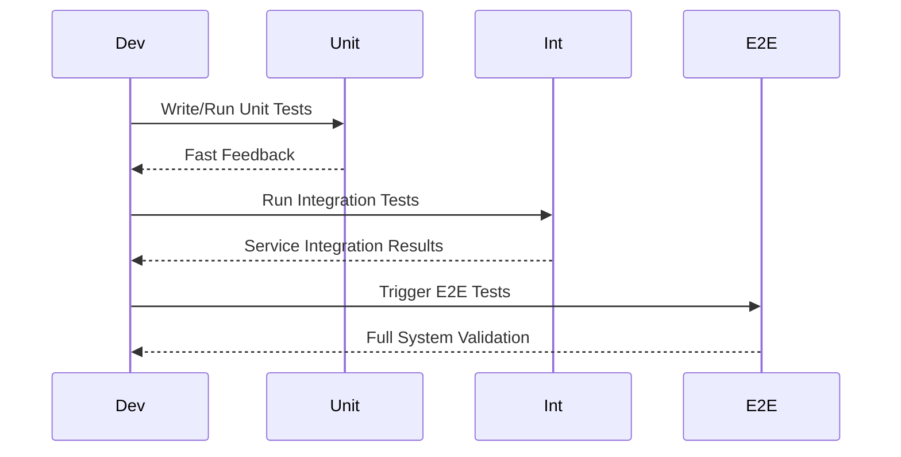
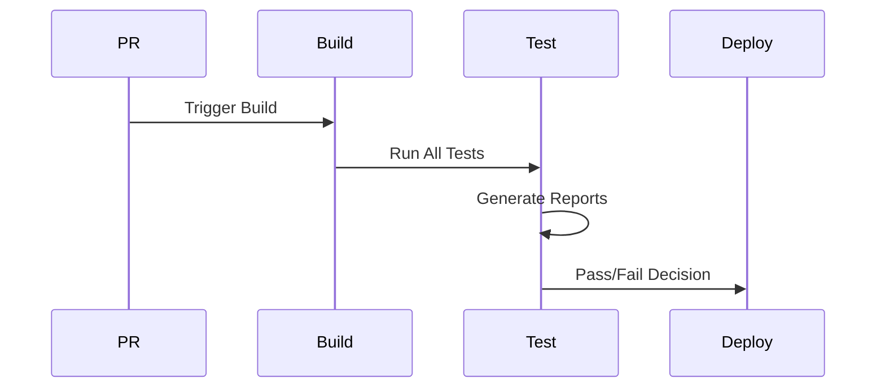
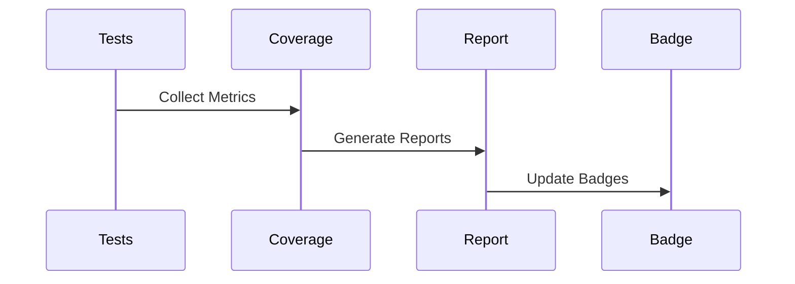

# Testing Strategy Architecture

## Overview

The Testing Strategy Architecture defines our comprehensive approach to ensuring software quality through automated testing. It implements a modern testing pyramid that balances unit, integration, and end-to-end testing while optimizing for speed, reliability, and maintainability.

Key objectives:
- Ensure code quality and prevent regressions
- Accelerate development velocity through fast feedback loops
- Maintain high test coverage across all layers
- Support continuous integration and deployment
- Enable confident refactoring and feature development

## Components

### Test Framework Layer
1. Core Testing Tools
   - Vitest: Primary unit and integration testing framework
   - Playwright: End-to-end testing automation
   - Testing Library: Component and hook testing utilities

2. Assertion Framework
   - Built-in assertions
   - Custom matchers
   - Snapshot testing capabilities

3. Mocking System
   - Mock Service Worker (MSW) for API mocking
   - Vi Mock for function/module mocking
   - Fixtures for test data management

### Test Types Layer
1. Unit Testing Components
   - Component test runners
   - Hook testing utilities
   - Utility function testers

2. Integration Testing Components
   - Feature test orchestrator
   - API test client
   - Flow test coordinator

3. E2E Testing Components
   - Browser automation engine
   - Mobile testing framework
   - Cross-browser test runner

### Infrastructure Layer
1. CI/CD Integration
   - Pipeline configuration
   - Test runners
   - Report generators

2. Coverage Analysis
   - Code coverage collectors
   - Report generators
   - Threshold validators

## Interactions

The testing system follows these primary workflows:

1. Development Testing Flow


2. CI/CD Testing Flow


3. Coverage Analysis Flow


## Implementation Details

### Test Runner Configuration
```typescript
interface TestConfig {
  framework: {
    name: 'vitest' | 'playwright';
    config: {
      timeout: number;
      retries: number;
      parallel: boolean;
    };
  };
  coverage: {
    provider: 'c8' | 'istanbul';
    thresholds: {
      statements: number;
      branches: number;
      functions: number;
      lines: number;
    };
  };
}

class TestRunner {
  async runTests(config: TestConfig): Promise<TestResult> {
    const runner = this.createRunner(config.framework);
    const coverage = new CoverageCollector(config.coverage);
    
    await runner.initialize();
    const results = await runner.execute();
    const coverageReport = await coverage.collect();
    
    return this.generateReport(results, coverageReport);
  }
}
```

### Mock Service Implementation
```typescript
interface MockConfig {
  mode: 'passthrough' | 'mock' | 'record';
  endpoints: {
    path: string;
    method: 'GET' | 'POST' | 'PUT' | 'DELETE';
    response: unknown;
  }[];
}

class MockService {
  async setupMocks(config: MockConfig): Promise<void> {
    const worker = new MockServiceWorker();
    
    config.endpoints.forEach(endpoint => {
      worker.use(
        rest[endpoint.method.toLowerCase()](
          endpoint.path,
          (req, res, ctx) => {
            return res(ctx.json(endpoint.response));
          }
        )
      );
    });
    
    await worker.start();
  }
}
```

### Test Utils
```typescript
interface TestUtils {
  render: (component: React.ComponentType) => RenderResult;
  fireEvent: typeof fireEvent;
  waitFor: typeof waitFor;
  screen: typeof screen;
}

class TestSetup {
  static createTestUtils(): TestUtils {
    return {
      render: (component) => render(
        <TestProvider>{component}</TestProvider>
      ),
      fireEvent,
      waitFor,
      screen,
    };
  }
}
```

## Testing Architecture Diagram

```mermaid
graph TB
    subgraph "Test Types"
        subgraph "Unit Tests"
            Component[Component Tests]
            Hook[Hook Tests]
            Util[Utility Tests]
        end

        subgraph "Integration"
            Feature[Feature Tests]
            Flow[Flow Tests]
            API[API Tests]
        end

        subgraph "E2E"
            UserFlow[User Flows]
            CrossBrowser[Cross Browser]
            Mobile[Mobile Tests]
        end
    end

    subgraph "Test Tools"
        subgraph "Frameworks"
            Vitest[Vitest]
            Playwright[Playwright]
            TestingLib[Testing Library]
        end

        subgraph "Mocking"
            MSW[MSW]
            ViMock[Vi Mock]
            DataMock[Data Mocks]
        end

        subgraph "Assertions"
            Expect[Expect]
            Matchers[Custom Matchers]
            Snapshot[Snapshots]
        end
    end

    subgraph "Coverage"
        subgraph "Metrics"
            Lines[Line Coverage]
            Branch[Branch Coverage]
            Function[Function Coverage]
        end

        subgraph "Reports"
            HTML[HTML Report]
            JSON[JSON Report]
            Badge[Coverage Badge]
        end

        subgraph "Thresholds"
            Min[Minimum Coverage]
            Target[Target Coverage]
            Trend[Coverage Trend]
        end
    end

    subgraph "CI/CD"
        subgraph "Pipeline"
            Build[Build Step]
            Test[Test Step]
            Report[Report Step]
        end

        subgraph "Automation"
            Schedule[Scheduled Tests]
            PR[PR Tests]
            Deploy[Deploy Tests]
        end

        subgraph "Performance"
            Speed[Test Speed]
            Resource[Resource Usage]
            Parallel[Parallelization]
        end
    end

    %% Test Flow
    Component --> Vitest
    Hook --> TestingLib
    Util --> ViMock

    Feature --> MSW
    Flow --> DataMock
    API --> Expect

    UserFlow --> Playwright
    CrossBrowser --> Matchers
    Mobile --> Snapshot

    %% Coverage Flow
    Lines --> HTML
    Branch --> JSON
    Function --> Badge

    HTML --> Min
    JSON --> Target
    Badge --> Trend

    %% CI/CD Flow
    Build --> Schedule
    Test --> PR
    Report --> Deploy

    Schedule --> Speed
    PR --> Resource
    Deploy --> Parallel
```



## Component Description

### Test Types

1. **Unit Testing**

   - Component testing
   - Hook testing
   - Utility testing

2. **Integration Testing**

   - Feature testing
   - Flow testing
   - API testing

3. **E2E Testing**
   - User flow testing
   - Cross-browser testing
   - Mobile testing

### Test Tools

1. **Testing Frameworks**

   - Vitest setup
   - Playwright config
   - Testing Library usage

2. **Mocking Strategy**
   - MSW setup
   - Vi mocking
   - Data mocking

## Implementation Guidelines

1. **Test Strategy**

   - Test pyramid
   - Coverage goals
   - Priority areas
   - Critical paths

2. **Test Design**

   - Test structure
   - Naming conventions
   - Assertion patterns
   - Mock strategies

3. **CI/CD Integration**

   - Pipeline setup
   - Automation rules
   - Performance optimization
   - Reporting

4. **Best Practices**

   - Test isolation
   - Data management
   - Error handling
   - Maintenance

5. **Performance**

   - Test speed
   - Resource usage
   - Parallelization
   - Optimization

6. **Documentation**
   - Test patterns
   - Setup guides
   - Mock examples
   - Coverage reports

## Best Practices

1. Test Organization
   - Group tests by feature/module
   - Follow AAA pattern (Arrange-Act-Assert)
   - Use descriptive test names
   - Keep tests focused and isolated

2. Mocking Strategy
   - Mock external dependencies
   - Use realistic test data
   - Avoid excessive mocking
   - Document mock behavior

3. Performance Optimization
   - Run tests in parallel when possible
   - Minimize test setup/teardown
   - Use appropriate test granularity
   - Cache test results when applicable

4. Maintenance
   - Regular test review and cleanup
   - Update tests with code changes
   - Monitor test coverage trends
   - Document test patterns and examples

## Related Documentation
- [CI/CD Pipeline](../infrastructure/ci-cd-pipeline.md)
- [Code Quality](../system/code-quality.md)
- [Development Workflow](../infrastructure/development-workflow.md)
- [Performance Monitoring](../infrastructure/performance-monitoring.md)
