# Testing Strategy Architecture

This diagram illustrates our comprehensive testing approach using Vitest, Playwright, and Testing Library.

## Testing Architecture Diagram

```mermaid
graph TB
    subgraph "Test Types"
        subgraph "Unit Tests"
            Component[Component Tests]
            Hook[Hook Tests]
            Util[Utility Tests]
        end

        subgraph "Integration"
            Feature[Feature Tests]
            Flow[Flow Tests]
            API[API Tests]
        end

        subgraph "E2E"
            UserFlow[User Flows]
            CrossBrowser[Cross Browser]
            Mobile[Mobile Tests]
        end
    end

    subgraph "Test Tools"
        subgraph "Frameworks"
            Vitest[Vitest]
            Playwright[Playwright]
            TestingLib[Testing Library]
        end

        subgraph "Mocking"
            MSW[MSW]
            ViMock[Vi Mock]
            DataMock[Data Mocks]
        end

        subgraph "Assertions"
            Expect[Expect]
            Matchers[Custom Matchers]
            Snapshot[Snapshots]
        end
    end

    subgraph "Coverage"
        subgraph "Metrics"
            Lines[Line Coverage]
            Branch[Branch Coverage]
            Function[Function Coverage]
        end

        subgraph "Reports"
            HTML[HTML Report]
            JSON[JSON Report]
            Badge[Coverage Badge]
        end

        subgraph "Thresholds"
            Min[Minimum Coverage]
            Target[Target Coverage]
            Trend[Coverage Trend]
        end
    end

    subgraph "CI/CD"
        subgraph "Pipeline"
            Build[Build Step]
            Test[Test Step]
            Report[Report Step]
        end

        subgraph "Automation"
            Schedule[Scheduled Tests]
            PR[PR Tests]
            Deploy[Deploy Tests]
        end

        subgraph "Performance"
            Speed[Test Speed]
            Resource[Resource Usage]
            Parallel[Parallelization]
        end
    end

    %% Test Flow
    Component --> Vitest
    Hook --> TestingLib
    Util --> ViMock

    Feature --> MSW
    Flow --> DataMock
    API --> Expect

    UserFlow --> Playwright
    CrossBrowser --> Matchers
    Mobile --> Snapshot

    %% Coverage Flow
    Lines --> HTML
    Branch --> JSON
    Function --> Badge

    HTML --> Min
    JSON --> Target
    Badge --> Trend

    %% CI/CD Flow
    Build --> Schedule
    Test --> PR
    Report --> Deploy

    Schedule --> Speed
    PR --> Resource
    Deploy --> Parallel
```

## Component Description

### Test Types

1. **Unit Testing**

   - Component testing
   - Hook testing
   - Utility testing

2. **Integration Testing**

   - Feature testing
   - Flow testing
   - API testing

3. **E2E Testing**
   - User flow testing
   - Cross-browser testing
   - Mobile testing

### Test Tools

1. **Testing Frameworks**

   - Vitest setup
   - Playwright config
   - Testing Library usage

2. **Mocking Strategy**
   - MSW setup
   - Vi mocking
   - Data mocking

## Implementation Guidelines

1. **Test Strategy**

   - Test pyramid
   - Coverage goals
   - Priority areas
   - Critical paths

2. **Test Design**

   - Test structure
   - Naming conventions
   - Assertion patterns
   - Mock strategies

3. **CI/CD Integration**

   - Pipeline setup
   - Automation rules
   - Performance optimization
   - Reporting

4. **Best Practices**

   - Test isolation
   - Data management
   - Error handling
   - Maintenance

5. **Performance**

   - Test speed
   - Resource usage
   - Parallelization
   - Optimization

6. **Documentation**
   - Test patterns
   - Setup guides
   - Mock examples
   - Coverage reports
