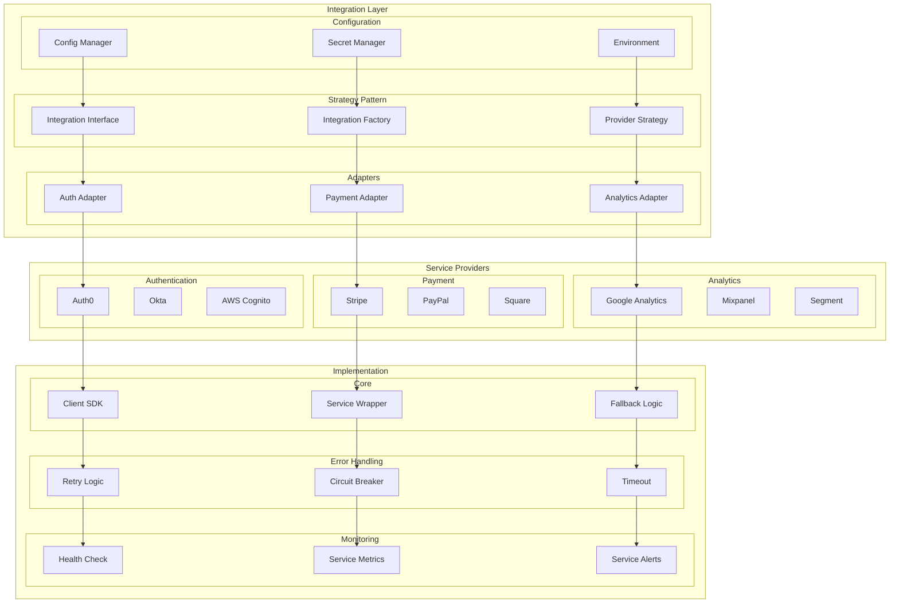

# Third-Party Integration Architecture

This diagram illustrates our strategy for integrating third-party services and libraries using the Strategy pattern.

## Implementation

Our third-party integrations are implemented using Service Wrapper particles as defined in our [Atomic Design Structure](../components/atomic-design.md#particles). These wrappers provide a consistent interface and handle cross-cutting concerns like error handling, retries, and monitoring.

## Integration Architecture Diagram

## Component Description

### Integration Layer

1. **Strategy Pattern**

   - Interface definition
   - Factory creation
   - Provider strategy

2. **Adapters**

   - Auth integration
   - Payment processing
   - Analytics tracking

3. **Configuration**
   - Config management
   - Secret handling
   - Environment setup

### Service Providers

1. **Authentication**

   - Auth0 integration
   - Okta setup
   - Cognito config

2. **Payment**

   - Stripe implementation
   - PayPal integration
   - Square setup

3. **Analytics**
   - GA configuration
   - Mixpanel setup
   - Segment integration

## Implementation Guidelines

1. **Integration Strategy**

   - Provider selection
   - Adapter pattern
   - Strategy pattern
   - Factory method

2. **Error Handling**

   - Retry mechanism
   - Circuit breaker
   - Timeout handling
   - Fallback logic

3. **Configuration**

   - Secret management
   - Environment vars
   - API keys
   - Credentials

4. **Best Practices**

   - Version pinning
   - Update strategy
   - Migration plan
   - Testing approach

5. **Monitoring**

   - Health checks
   - Service metrics
   - Alert system
   - Performance tracking

6. **Documentation**
   - Integration guides
   - API references
   - Config specs
   - Migration docs
