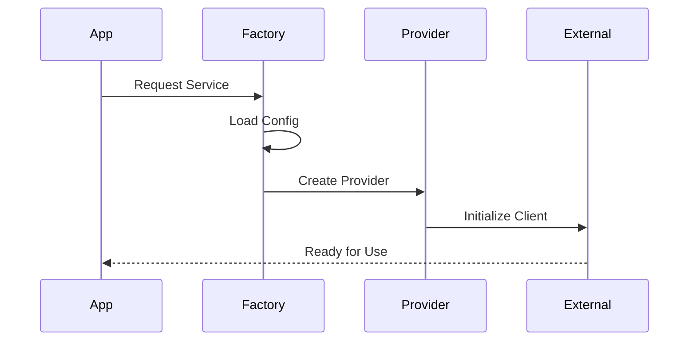
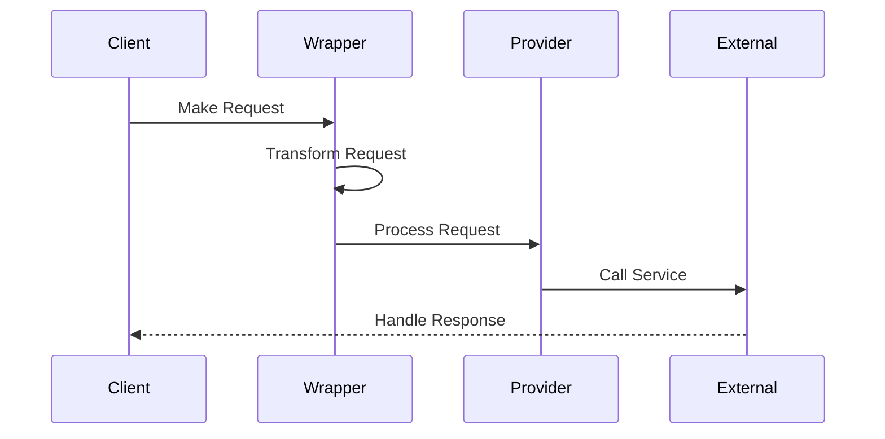
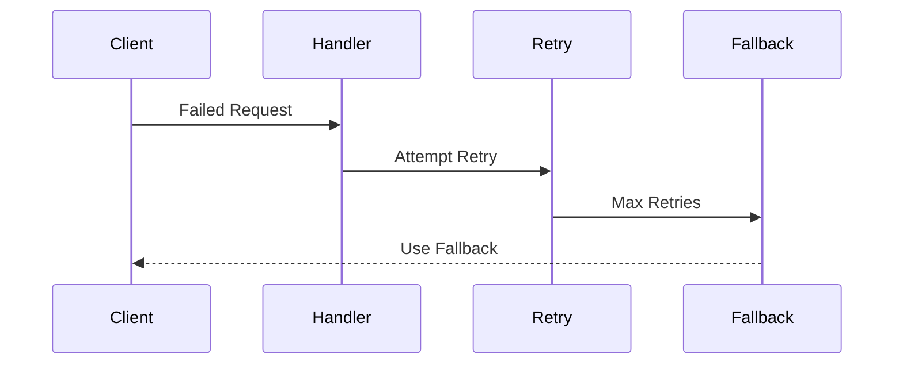
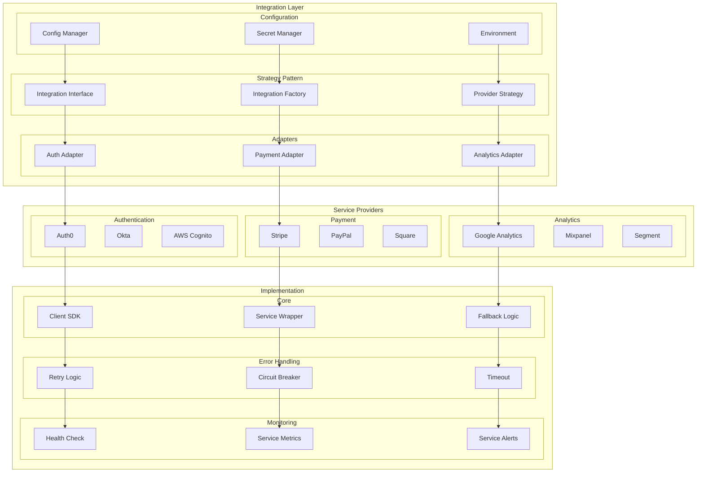

# Third-Party Integration Architecture

## Overview

The Third-Party Integration Architecture provides a flexible and maintainable approach to integrating external services and libraries into our system. Using the Strategy pattern and Service Wrapper particles, we ensure consistent integration behavior, robust error handling, and seamless provider switching capabilities.

Key Features:
- Provider-agnostic interfaces
- Automatic fallback mechanisms
- Centralized configuration management
- Comprehensive monitoring and alerting
- Standardized error handling

Benefits:
- Reduced vendor lock-in
- Simplified provider switching
- Consistent integration patterns
- Enhanced system resilience
- Centralized monitoring

## Components

### Integration Layer
1. Strategy Components
   - Integration interfaces
   - Provider factories
   - Strategy implementations
   - Configuration managers

2. Service Adapters
   - Authentication adapters
   - Payment processing adapters
   - Analytics adapters
   - API clients

3. Configuration Management
   - Environment configuration
   - Secret management
   - Provider settings
   - Feature flags

### Service Layer
1. Core Services
   - Authentication (Auth0, Okta, Cognito)
   - Payment processing (Stripe, PayPal)
   - Analytics (GA, Mixpanel)
   - External APIs

2. Service Wrappers
   - Request/response transformation
   - Error handling
   - Retry logic
   - Circuit breakers

3. Monitoring
   - Health checks
   - Performance metrics
   - Error tracking
   - Usage analytics

## Interactions

The third-party integration system follows these key workflows:

1. Service Integration Flow


2. Request Processing Flow


3. Error Recovery Flow


## Implementation Details

### Service Factory Implementation
```typescript
interface ServiceConfig {
  provider: string;
  credentials: {
    apiKey: string;
    apiSecret?: string;
  };
  options: {
    timeout: number;
    retries: number;
  };
}

class ServiceFactory {
  private providers: Map<string, Provider>;
  
  async createService(config: ServiceConfig): Promise<Service> {
    const provider = this.providers.get(config.provider);
    if (!provider) {
      throw new UnsupportedProviderError(config.provider);
    }
    
    return provider.initialize(config);
  }
  
  registerProvider(name: string, provider: Provider): void {
    this.providers.set(name, provider);
  }
}
```

### Service Wrapper Implementation
```typescript
interface RetryConfig {
  attempts: number;
  backoff: number;
  timeout: number;
}

class ServiceWrapper<T> {
  constructor(
    private service: T,
    private retryConfig: RetryConfig
  ) {}
  
  async execute<R>(
    operation: (service: T) => Promise<R>
  ): Promise<R> {
    let lastError: Error;
    
    for (let attempt = 1; attempt <= this.retryConfig.attempts; attempt++) {
      try {
        return await this.timeoutPromise(
          operation(this.service),
          this.retryConfig.timeout
        );
      } catch (error) {
        lastError = error;
        if (!this.isRetryable(error)) {
          throw error;
        }
        await this.delay(this.calculateBackoff(attempt));
      }
    }
    
    throw new MaxRetriesExceededError(lastError);
  }
  
  private calculateBackoff(attempt: number): number {
    return this.retryConfig.backoff * Math.pow(2, attempt - 1);
  }
}
```

### Provider Implementation
```typescript
interface ProviderOptions {
  timeout: number;
  retries: number;
  circuitBreaker: {
    threshold: number;
    resetTimeout: number;
  };
}

abstract class BaseProvider implements Provider {
  protected client: any;
  private circuitBreaker: CircuitBreaker;
  
  constructor(
    protected config: ServiceConfig,
    protected options: ProviderOptions
  ) {
    this.circuitBreaker = new CircuitBreaker(options.circuitBreaker);
  }
  
  async initialize(): Promise<void> {
    this.client = await this.createClient();
    await this.validateConnection();
    
    this.setupMonitoring();
    this.registerMetrics();
  }
  
  protected abstract createClient(): Promise<any>;
  
  protected async executeWithCircuitBreaker<T>(
    operation: () => Promise<T>
  ): Promise<T> {
    return this.circuitBreaker.execute(operation);
  }
}
```

## Implementation

Our third-party integrations are implemented using Service Wrapper particles as defined in our [Atomic Design Structure](../components/atomic-design.md#particles). These wrappers provide a consistent interface and handle cross-cutting concerns like error handling, retries, and monitoring.

## Integration Architecture Diagram



## Component Description

### Integration Layer

1. **Strategy Pattern**

   - Interface definition
   - Factory creation
   - Provider strategy

2. **Adapters**

   - Auth integration
   - Payment processing
   - Analytics tracking

3. **Configuration**
   - Config management
   - Secret handling
   - Environment setup

### Service Providers

1. **Authentication**

   - Auth0 integration
   - Okta setup
   - Cognito config

2. **Payment**

   - Stripe implementation
   - PayPal integration
   - Square setup

3. **Analytics**
   - GA configuration
   - Mixpanel setup
   - Segment integration

## Implementation Guidelines

1. **Integration Strategy**

   - Provider selection
   - Adapter pattern
   - Strategy pattern
   - Factory method

2. **Error Handling**

   - Retry mechanism
   - Circuit breaker
   - Timeout handling
   - Fallback logic

3. **Configuration**

   - Secret management
   - Environment vars
   - API keys
   - Credentials

4. **Best Practices**

   - Version pinning
   - Update strategy
   - Migration plan
   - Testing approach

5. **Monitoring**

   - Health checks
   - Service metrics
   - Alert system
   - Performance tracking

6. **Documentation**
   - Integration guides
   - API references
   - Config specs
   - Migration docs
