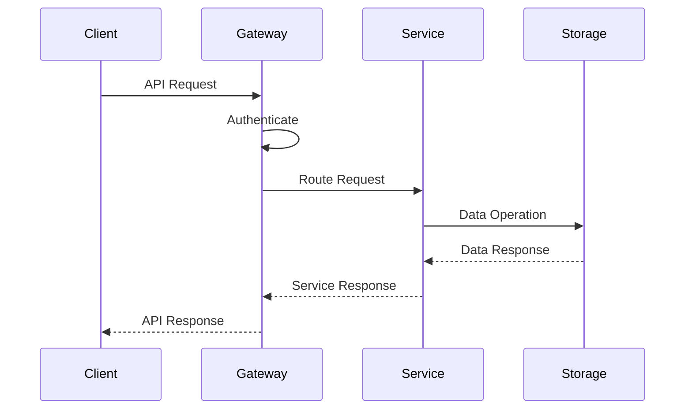
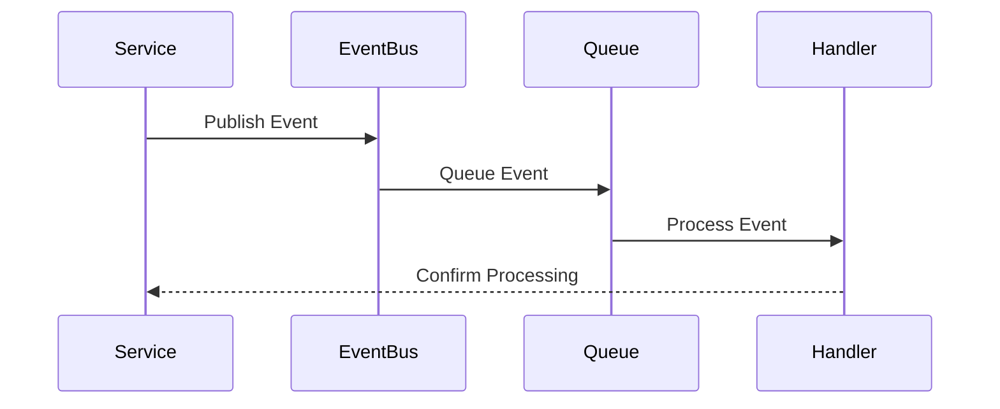
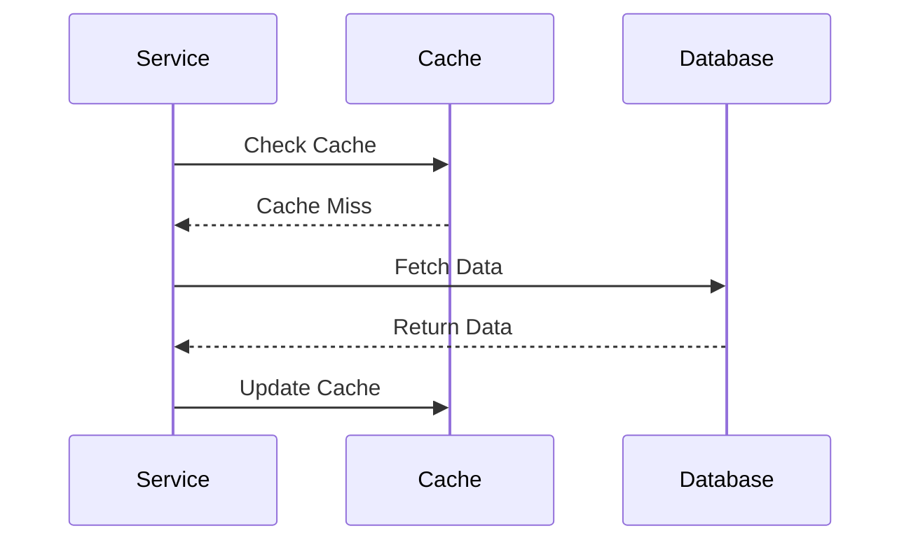
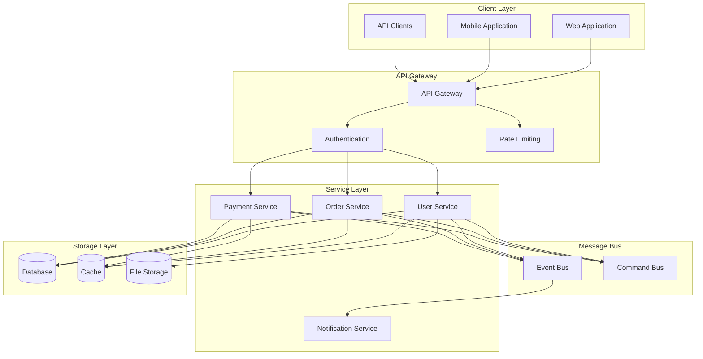

# System Workflow Architecture

## Overview

The System Workflow Architecture defines the high-level organization and interaction patterns between different system components. This architecture implements a layered approach with clear separation of concerns, ensuring scalability, maintainability, and reliability of the system.

Key Features:
- Layered architecture
- Event-driven communication
- Microservices design
- Scalable infrastructure
- Fault tolerance

Benefits:
- System modularity
- Independent scaling
- Improved reliability
- Better maintainability
- Enhanced security

## Components

### Client Components
1. Web Application
   - Next.js frontend
   - React components
   - Client-side state
   - API integration

2. Mobile Applications
   - Native clients
   - Cross-platform support
   - Offline capabilities
   - Push notifications

3. API Clients
   - SDK libraries
   - Authentication
   - Rate limiting
   - Error handling

### Infrastructure Components
1. API Gateway
   - Request routing
   - Authentication
   - Rate limiting
   - Load balancing

2. Service Layer
   - User service
   - Order service
   - Payment service
   - Notification service

3. Message Bus
   - Event bus
   - Command bus
   - Message queues
   - Event store

### Storage Components
1. Database Systems
   - Primary database
   - Read replicas
   - Sharding
   - Backups

2. Caching Layer
   - Distributed cache
   - Local caches
   - Cache invalidation
   - Cache warming

3. File Storage
   - Object storage
   - CDN integration
   - File versioning
   - Access control

## Interactions

The system components interact through these key workflows:

1. Request Flow

2. Event Flow

3. Cache Flow

## Workflow Diagram

## Description

Our system workflow is organized into several layers:

1. **Client Layer**

   - Web application (Next.js)
   - Mobile applications
   - External API clients

2. **API Gateway**

   - Request routing
   - Authentication/Authorization
   - Rate limiting
   - Request/Response transformation

3. **Service Layer**

   - Microservices architecture
   - Domain-specific services
   - Independent scaling
   - Service isolation

4. **Message Bus**

   - Event-driven communication
   - Command handling
   - Message queuing
   - Event sourcing

5. **Storage Layer**
   - Relational databases
   - Caching layer
   - File storage
   - Data replication

## Implementation Details

- Uses REST and GraphQL APIs
- Implements event sourcing
- Supports CQRS pattern
- Provides message queuing
- Ensures data consistency
