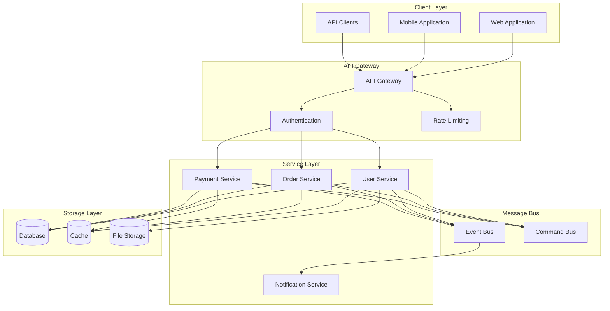

# System Workflow Architecture

This diagram illustrates the high-level workflow and interaction between different system components.

## Workflow Diagram

## Description

Our system workflow is organized into several layers:

1. **Client Layer**

   - Web application (Next.js)
   - Mobile applications
   - External API clients

2. **API Gateway**

   - Request routing
   - Authentication/Authorization
   - Rate limiting
   - Request/Response transformation

3. **Service Layer**

   - Microservices architecture
   - Domain-specific services
   - Independent scaling
   - Service isolation

4. **Message Bus**

   - Event-driven communication
   - Command handling
   - Message queuing
   - Event sourcing

5. **Storage Layer**
   - Relational databases
   - Caching layer
   - File storage
   - Data replication

## Implementation Details

- Uses REST and GraphQL APIs
- Implements event sourcing
- Supports CQRS pattern
- Provides message queuing
- Ensures data consistency
