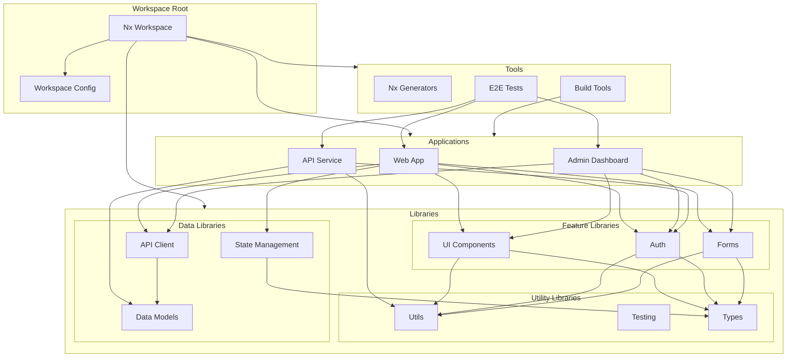

# Nx Workspace Architecture

This diagram illustrates the structure and organization of our Nx monorepo workspace, showing the relationships between different applications, libraries, and tools.

## Workspace Architecture Diagram

## Component Description

### Workspace Structure

- **Root**: Main workspace configuration
- **Applications**: Deployable applications
- **Libraries**: Shared code modules
- **Tools**: Development and build tools

### Applications

- **Web App**: Main Next.js application
- **Admin Dashboard**: CMS and administration
- **API Service**: Backend services

### Libraries

1. **Feature Libraries**

   - Auth: Authentication/Authorization
   - UI: Shared UI components
   - Forms: Form management

2. **Utility Libraries**

   - Utils: Common utilities
   - Testing: Test helpers
   - Types: TypeScript types

3. **Data Libraries**
   - Models: Data models/schemas
   - API: API client/services
   - Store: State management

## Implementation Guidelines

1. **Code Organization**

   - Clear module boundaries
   - Proper dependency management
   - Consistent naming conventions
   - Library categorization

2. **Dependency Management**

   - Minimize circular dependencies
   - Clear dependency boundaries
   - Version management
   - Package organization

3. **Build Configuration**

   - Optimized builds
   - Environment management
   - Cache configuration
   - Build pipelines

4. **Development Workflow**

   - Library generation
   - Component development
   - Testing strategy
   - Documentation

5. **Best Practices**
   - Code sharing
   - Module boundaries
   - Library scope
   - Dependency graph management
