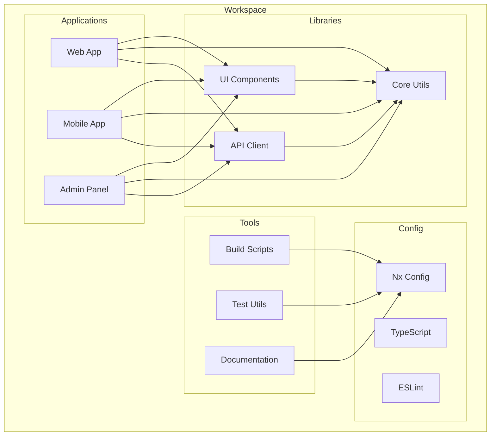
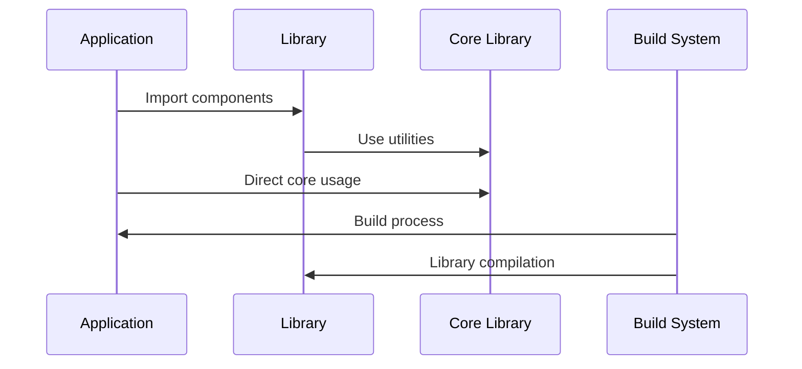

# Workspace Architecture

This document describes the architectural design of our Nx-based monorepo workspace, outlining how different applications, libraries, and tools are organized and interact within the system.

## Overview

Our workspace architecture is built on Nx, providing a scalable and maintainable structure for managing multiple applications and shared libraries. The architecture emphasizes code reusability, clear boundaries between components, and efficient build processes.

## Components

- **Apps**: Standalone applications (web, mobile, etc.)
- **Libraries**: Shared code and functionality
- **Tools**: Development and build utilities
- **Configuration**: Workspace-level settings



## Interactions

The workspace components interact through a well-defined dependency graph:

1. Applications consume libraries
2. Libraries can depend on other libraries
3. Tools operate across all components
4. Configuration affects the entire workspace



## Implementation Details

### Technical Stack

- Nx 17+: Workspace management and build system
- TypeScript 5+: Type safety and modern JavaScript features
- ESLint/Prettier: Code quality and formatting
- Vitest: Testing framework
- Bun: Package management and runtime

### Key Configurations

```typescript
// workspace.json
{
  "version": 2,
  "projects": {
    "web": {
      "root": "apps/web",
      "sourceRoot": "apps/web/src",
      "projectType": "application"
    },
    "ui": {
      "root": "libs/ui",
      "sourceRoot": "libs/ui/src",
      "projectType": "library"
    }
  }
}
```

### Error Handling

- **Circular Dependencies**: Detected and prevented through Nx dependency graph
- **Build Failures**: Isolated to affected projects only
- **Type Errors**: Caught at compile-time through TypeScript

### Performance Considerations

- **Caching**: Nx's computation caching for faster builds
- **Affected Commands**: Only rebuild what changed
- **Parallel Execution**: Multiple tasks run concurrently
- **Code Splitting**: Optimized bundle sizes

## Related Documentation

- [Build Optimization](../infrastructure/build-optimization.md)
- [Dependencies Management](../infrastructure/dependencies.md)
- [CI/CD Pipeline](../infrastructure/ci-cd-pipeline.md)
