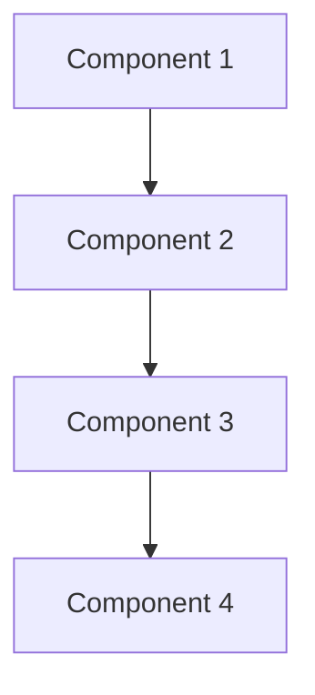
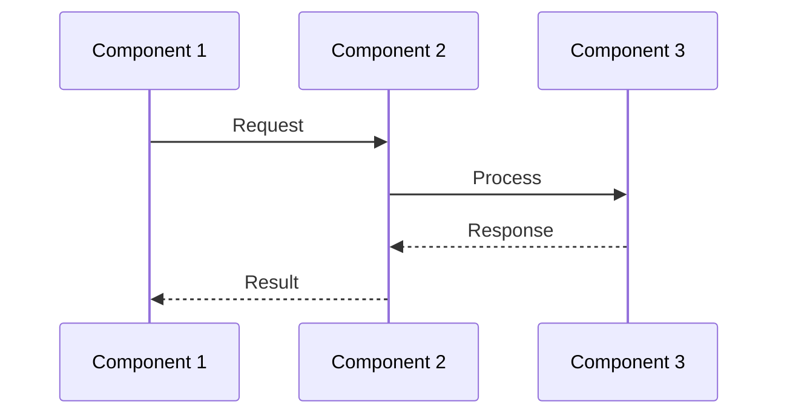

# [Component/Feature] Architecture

A brief description of what this architecture document covers and its purpose.

## Overview

High-level overview of the component/feature, including its main purpose and role in the system.

## Components

Key components and their responsibilities:

- Component 1: Description
- Component 2: Description
- Component 3: Description



## Interactions

Describes how components interact with each other and the flow of data/control:

1. Step 1: Description
2. Step 2: Description
3. Step 3: Description



## Implementation Details

### Technical Stack

- Technology 1: Purpose/Usage
- Technology 2: Purpose/Usage
- Technology 3: Purpose/Usage

### Key Interfaces

```typescript
interface MainInterface {
    method1(): Promise<void>;
    method2(param: string): boolean;
}
```

### Configuration

```typescript
const config = {
    option1: 'value1',
    option2: 'value2'
};
```

### Error Handling

Describes how errors are handled in this component:

- Error Scenario 1: Handling approach
- Error Scenario 2: Handling approach

### Performance Considerations

- Consideration 1: Impact and mitigation
- Consideration 2: Impact and mitigation

## Related Documentation

- [API Documentation](../diagrams/system/api.md)
- [Link to Data Flow Documentation](../data-flow/overview.md)
