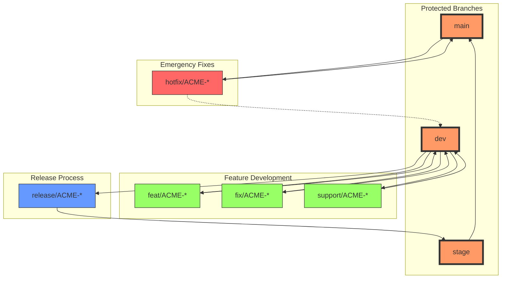

# Branch Naming Convention

This document outlines our branch naming strategy and workflow conventions.

## Branching Strategy Diagram

```mermaid
gitGraph
    commit
    branch dev
    checkout dev
    commit

    %% Feature branch workflow
    branch "feat/ACME-123-user-auth"
    commit
    commit
    checkout dev
    merge "feat/ACME-123-user-auth"

    %% Support branch workflow
    branch "support/ACME-124-perf"
    commit
    checkout dev
    merge "support/ACME-124-perf"

    %% Bug fix workflow
    branch "fix/ACME-125-null-check"
    commit
    checkout dev
    merge "fix/ACME-125-null-check"

    %% Release branch
    branch stage
    checkout stage
    branch "release/ACME-126-v1"
    commit
    checkout stage
    merge "release/ACME-126-v1"

    %% Main branch
    branch main
    checkout main
    merge stage

    %% Hotfix workflow
    branch "hotfix/ACME-127-critical"
    commit
    checkout main
    merge "hotfix/ACME-127-critical"
    checkout dev
    merge "hotfix/ACME-127-critical"
```

## Branch Flow Diagram



## Branch Pattern

```
<type>/ACME-<ticket>-<description>
```

Example: `feat/ACME-123-add-user-authentication`

## Branch Types

### Feature Branches (`feat/`)

- Purpose: Implementing new features
- Pattern: `feat/ACME-<ticket>-<description>`
- Example: `feat/ACME-123-add-oauth-login`
- Workflow:
  - Created from: `dev`
  - Merges to: `dev`
  - Requires: Full CI/CD pipeline checks

### Bug Fix Branches (`fix/`)

- Purpose: Fixing identified bugs
- Pattern: `fix/ACME-<ticket>-<description>`
- Example: `fix/ACME-456-handle-null-user-response`
- Workflow:
  - Created from: `dev`
  - Merges to: `dev`
  - Requires: Full CI/CD pipeline checks

### Hot Fix Branches (`hotfix/`)

- Purpose: Critical patches for production issues
- Pattern: `hotfix/ACME-<ticket>-<description>`
- Example: `hotfix/ACME-789-fix-auth-bypass`
- Special Considerations:
  - Bypasses standard CI/CD checks
  - Requires only critical security checks
  - Fast-tracked to production
- Workflow:
  - Created from: `main`
  - Merges to: `main` and `dev`
  - Cherry-picked to other environments after fix

### Release Branches (`release/`)

- Purpose: Staging new features for testing and canary deployments
- Pattern: `release/ACME-<ticket>-<description>`
- Example: `release/ACME-100-v1-2-0`
- Additional Checks:
  - Performance (Lighthouse)
  - Security (Snyk)
  - Dependency audits
  - E2E tests
- Workflow:
  - Created from: `dev`
  - Merges to: `stage` and then `main`
  - Requires: Full test suite + additional checks

### Support Branches (`support/`)

- Purpose: Non-user-facing technical improvements
- Pattern: `support/ACME-<ticket>-<description>`
- Example: `support/ACME-234-optimize-build-pipeline`
- Use Cases:
  - Refactoring
  - CI/CD improvements
  - Performance optimizations
  - Documentation updates
  - Developer tooling
- Workflow:
  - Created from: `dev`
  - Merges to: `dev`
  - Requires: Standard CI/CD checks

## Protected Branches

### Main Branch (`main`)

- Production environment
- Protected from direct pushes
- Receives merges from:
  - `stage` (via release branches)
  - `hotfix/*` branches (emergency fixes)

### Staging Branch (`stage`)

- Pre-production testing environment
- Protected from direct pushes
- Receives merges from:
  - `release/*` branches
  - Runs full suite of tests and checks

### Development Branch (`dev`)

- Main development branch
- Protected from direct pushes
- Base branch for new feature development
- Receives merges from:
  - `feat/*`
  - `fix/*`
  - `support/*`

## Branch Lifecycle

1. **Creation**

   ```bash
   git checkout dev
   git pull origin dev
   git checkout -b <type>/ACME-<ticket>-<description>
   ```

2. **Development**

   - Regular commits following commit message conventions
   - Keep branch up to date with base branch

3. **Pre-merge Checklist**

   - Branch is up to date with base branch
   - All CI/CD checks pass
   - Code review approved
   - No merge conflicts

4. **Merging**

   ```bash
   git checkout <base-branch>
   git pull origin <base-branch>
   git merge --no-ff <your-branch>
   git push origin <base-branch>
   ```

5. **Cleanup**
   ```bash
   git branch -d <your-branch>
   git push origin --delete <your-branch>
   ```

## Special Considerations

### Hotfix Process

1. Create hotfix branch from main
2. Implement minimal fix
3. Fast-track testing and deployment
4. Merge to main AND dev
5. Deploy to production
6. Create proper fix in `fix/*` branch if needed

### Release Process

1. Create release branch from dev
2. Run additional checks and tests
3. Deploy to staging environment
4. Perform UAT and testing
5. Merge to main when approved
6. Tag release version

## Branch Protection Rules

### Local Protection

We enforce branch protection locally through Git hooks:

1. **Pre-commit Hook**

   - Prevents direct commits to protected branches
   - Runs before each commit
   - Checks current branch against `.branchnaming` protected list
   - Enforces additional quality checks:
     - Lint-staged
     - Type checking
     - Tests
     - Builds
     - Changelog generation

2. **Pre-push Hook**

   - Prevents pushing to protected branches
   - Runs before each push
   - Validates branch naming convention
   - Checks current branch against protected list

3. **Protected Branches**
   ```json
   {
     "protected": ["dev", "stage", "main"]
   }
   ```

### GitHub Protection

Repository administrators should configure the following branch protection rules in GitHub:

1. **Access Settings**

   - Require pull request reviews
   - Required number of approvals: 1+
   - Dismiss stale pull request approvals
   - Require review from Code Owners
   - Restrict who can push to matching branches

2. **Status Checks**

   - Require status checks to pass
   - Require branches to be up to date
   - Required checks:
     - CI/CD pipeline
     - Type checking
     - Tests
     - Linting
     - Security scans

3. **Additional Settings**
   - Include administrators
   - Allow force pushes: Disabled
   - Allow deletions: Disabled

### How Protection Works

1. **Local Development**

   ```bash
   # Attempting to commit to protected branch
   git checkout main
   git commit -m "feat: new feature"
   # Error: Direct changes to protected branch 'main' are not allowed

   # Correct workflow
   git checkout -b feat/ACME-123-new-feature
   git commit -m "feat: new feature"
   # Success: Commit allowed on feature branch
   ```

2. **Pull Request Process**

   - Create PR from feature branch to protected branch
   - Required reviews must be approved
   - All status checks must pass
   - Branch must be up to date
   - Only then merge is allowed

3. **Emergency Hotfixes**
   - Even hotfix branches follow protection rules
   - Create `hotfix/ACME-XXX` branch
   - Fast-track review process
   - Merge to `main` and backport to `dev`

### Setting Up Protection

1. **Local Setup**

   ```bash
   # Protection is automatically enabled via Husky hooks
   # Hooks are installed on:
   npm install
   # or
   bun install
   ```

2. **GitHub Setup**
   1. Go to repository Settings
   2. Navigate to Branches
   3. Add branch protection rule
   4. Select branch name pattern (e.g., `main`)
   5. Configure protection settings as described above
   6. Repeat for each protected branch

### Troubleshooting

If you receive a branch protection error:

1. **Local Protection Error**

   ```bash
   Direct changes to protected branch 'main' are not allowed
   ```

   Solution:

   - Create a new feature branch
   - Submit changes via pull request

2. **GitHub Protection Error**
   ```
   ! [remote rejected] main -> main (protected branch hook declined)
   ```
   Solution:
   - Create pull request
   - Get required approvals
   - Ensure checks pass

## Tools and Automation

- Branch naming enforced by `branch-naming-check`
- Configuration in `.branchnaming`
- Automated checks in pre-push hook
- CI/CD pipeline integration
