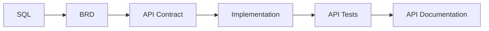
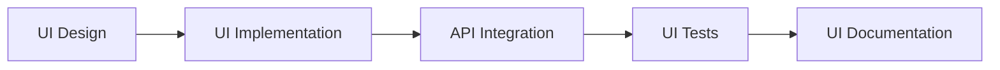

# Implementation Flow

## Database Layer

## API Layer

## UI Layer

## Resources
- [AsyncAPI Documentation](https://www.asyncapi.com/en)
- [AI SDLC Automation Reference](https://github.com/raidendotai/cofounder)

## Notes
- AI prompts should be cost-effective and focused
- Each phase should be fully tested before proceeding
- Documentation should be continuously updated
- Security and performance should be considered at each step
